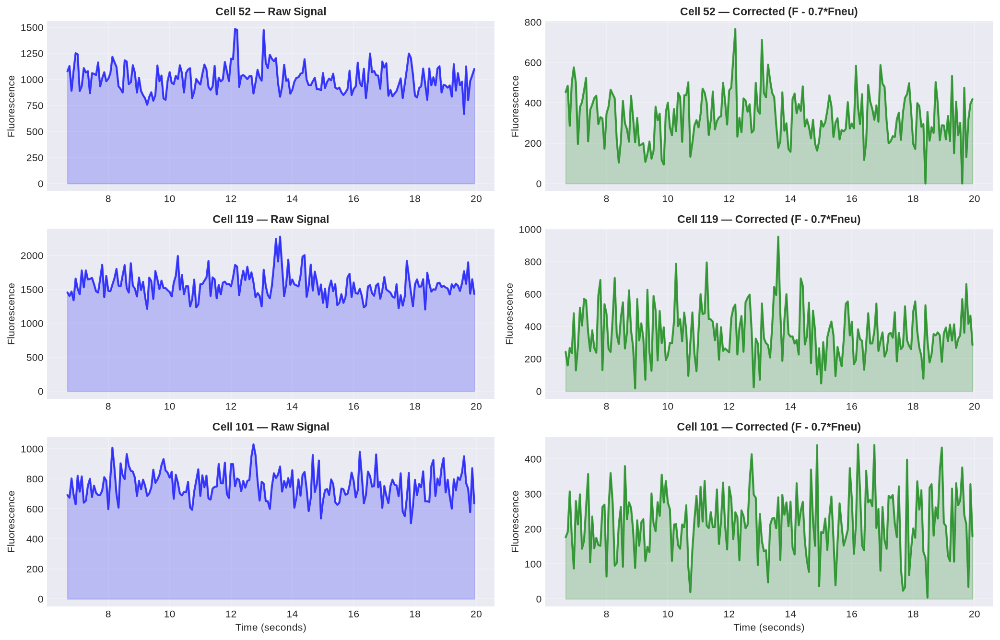
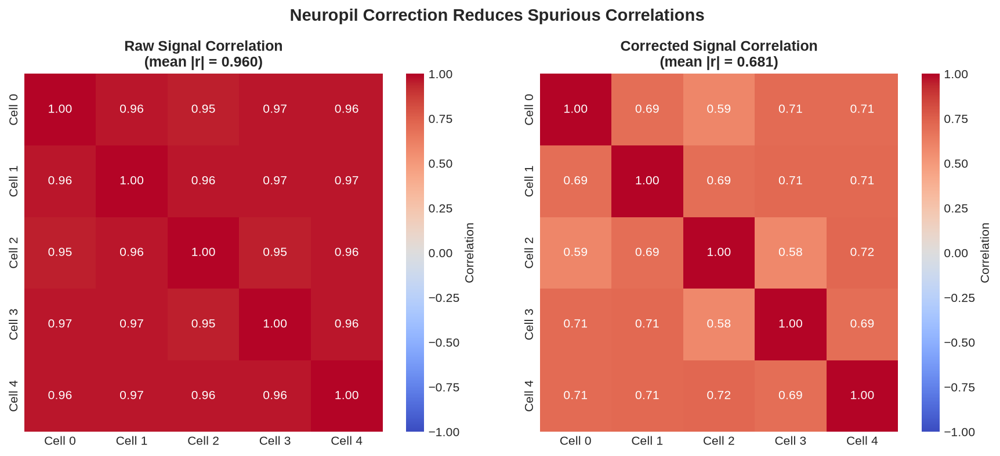
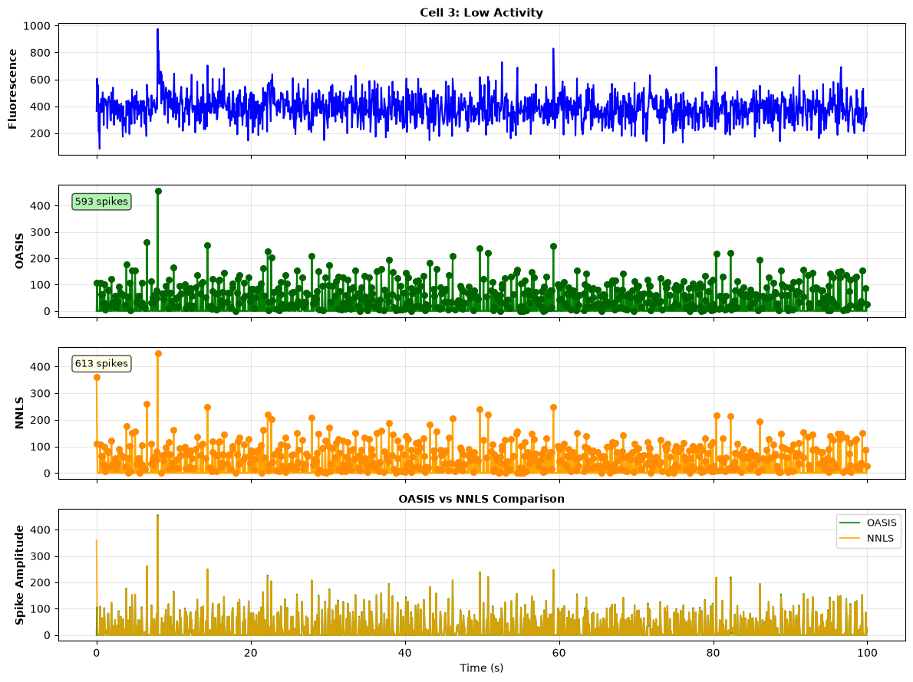
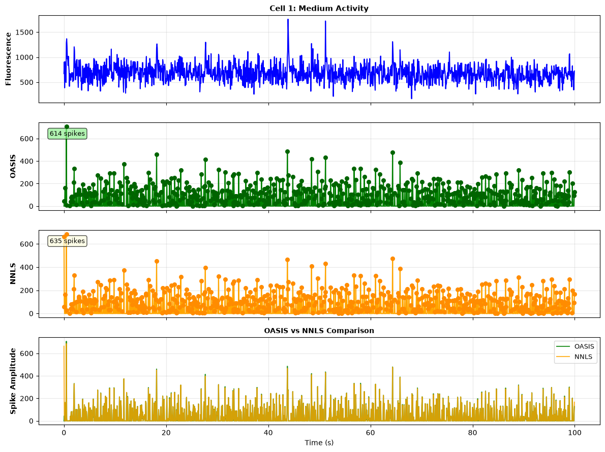
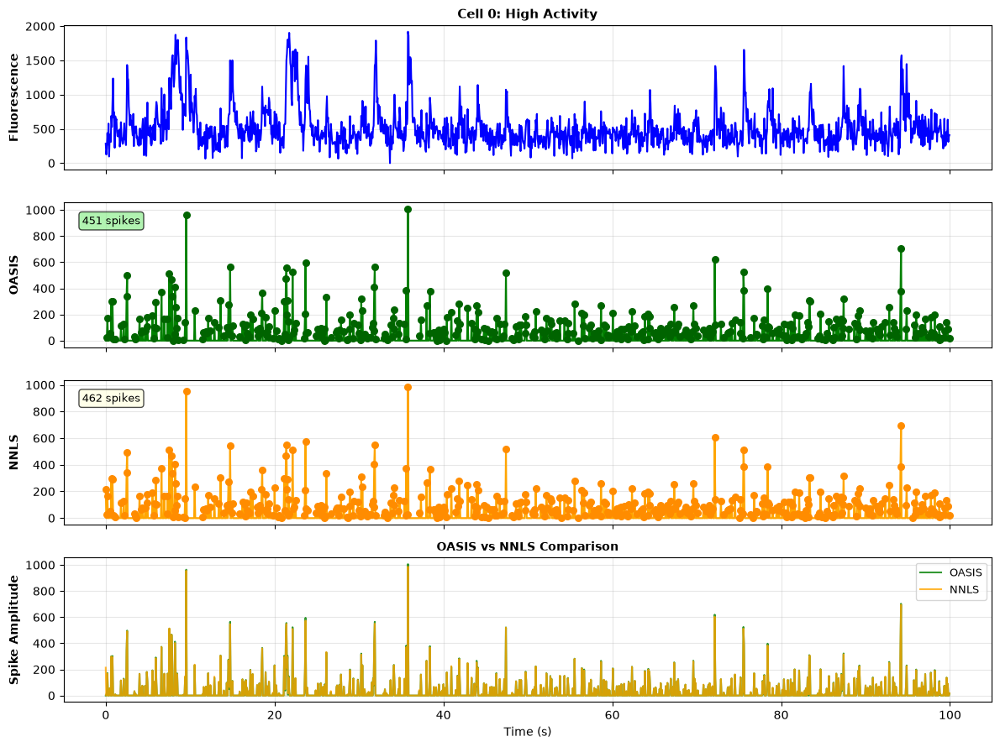
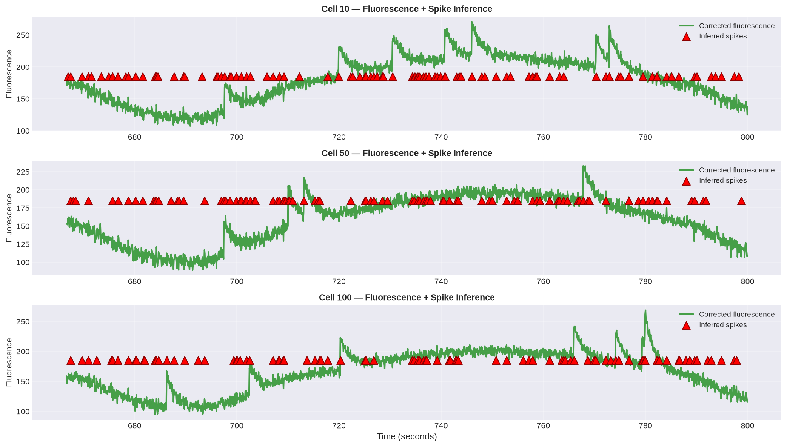
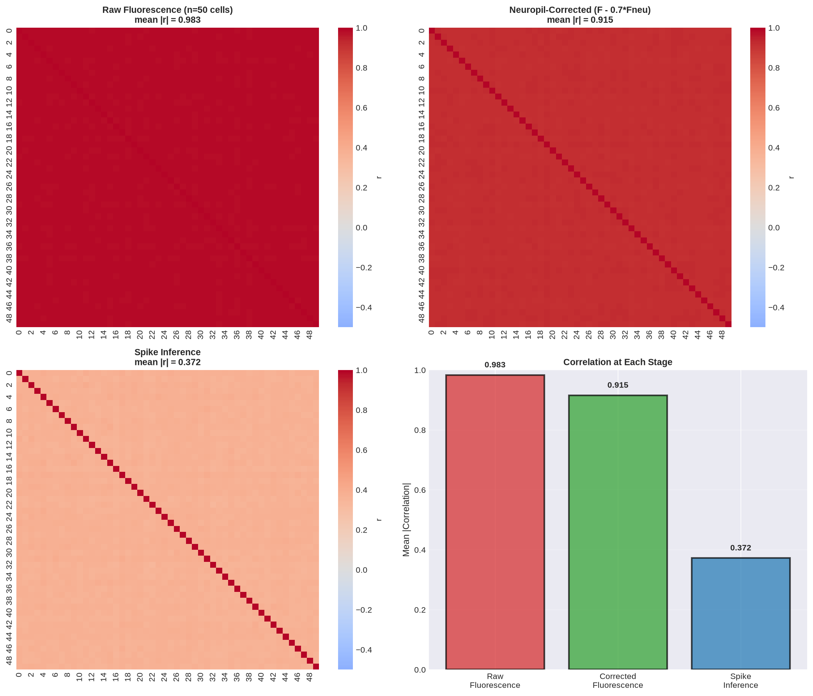
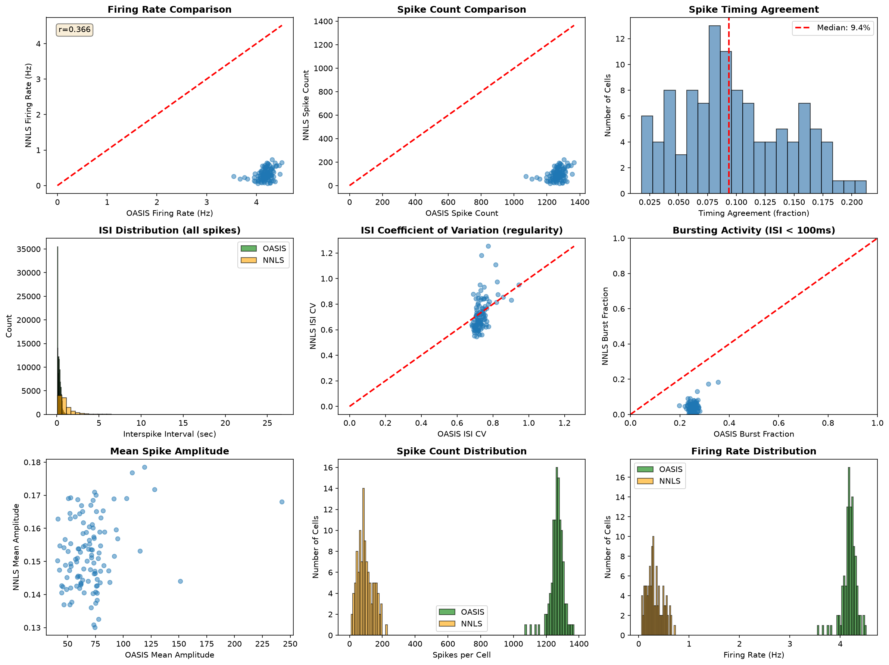
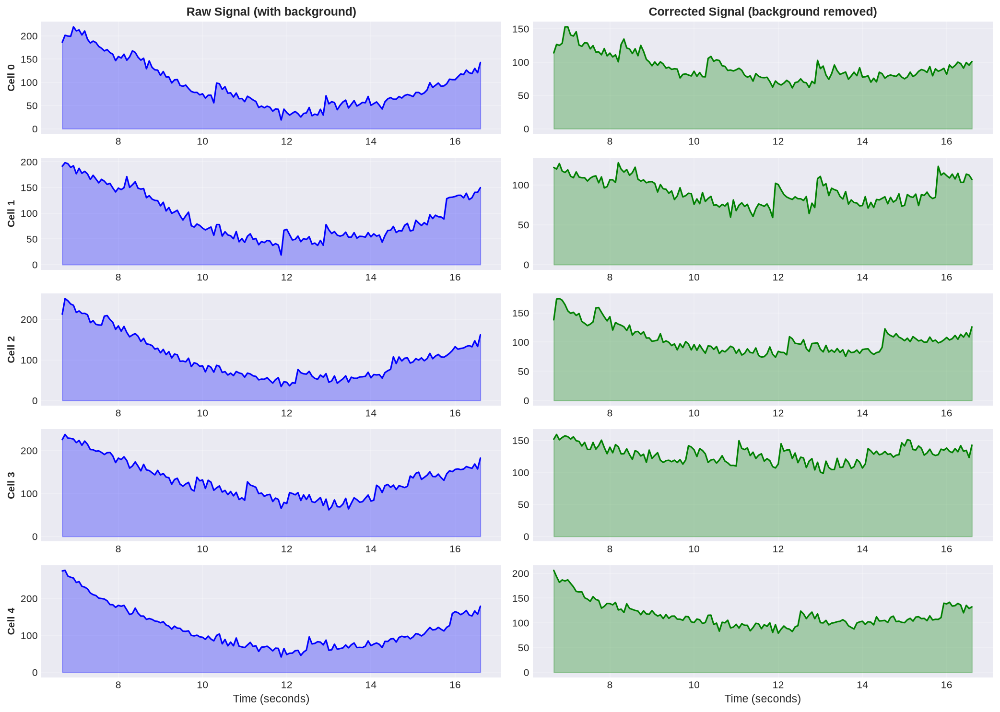

# Day 1: Calcium Imaging Analysis with Agentic AI
## Two-Photon Neural Recording in Real Time

Learn to analyze real neural recordings from awake mice using Python and agentic AI (Cline + Gemini). This Friday evening exercise teaches you three core skills: **ROI detection** (finding neurons), **spike deconvolution** (recovering spikes from fluorescence), and **neuropil correction** (removing contamination).

---

## Quick Start: Get Set Up on SCC

### Step 1: Access the SCC via OnDemand

Go to: [https://scc-ondemand2.bu.edu/](https://scc-ondemand2.bu.edu/)

Log in with your BU username/password. This opens a web-based interface — no terminal needed.

### Step 1b: Launch VS Code Server Interactive App

Once logged in to OnDemand:

1. Click **Interactive Apps** (left sidebar)
2. Click **VS Code Server**
3. Fill in the form with these settings:

   | Setting | Value |
   |---------|-------|
   | **Number of hours** | 6 |
   | **Number of cores** | 1 |
   | **Number of GPUs** | 0 |
   | **Project** | npcr25 |
   | **Additional modules to load** | python3/3.13.8 |
   | **Working Directory** | `/projectnb/npcr25/students/username` |

   ⚠️ **Important**: Replace `username` with your SCC username (same as your BU login)

4. Click **Launch**
5. Wait for the session to start (1-2 minutes)
6. Click the **VS Code Server** button that appears
7. VS Code opens in your browser — you're now on the SCC with everything pre-loaded!

---

## Set Up Cline + Gemini AI (Required)

**Cline** is your AI coding assistant. You'll use it throughout the exercise to debug code, explain concepts, and get help.

### Installation Steps

1. Click on the **Extensions** toolbar item in VSCode and search for **"Cline"** and install.
2. Click on the **"robot"** icon that should appear in the left toolbar to open Cline.
3. Choose **"Bring my own API key"**.
4. For API provider choose **"OpenAI Compatible"**.
5. For Base URL type: `https://generativelanguage.googleapis.com/v1beta/openai/`
6. Navigate to [https://aistudio.google.com/api-keys](https://aistudio.google.com/api-keys) (make sure you are logged in as your personal Google account) and click **"Create API key"**. This will create a project and API key.
7. For OpenAI Compatible API key, copy-paste the key you just created.
8. For model type: `gemini-3.1-flash-lite`

### How to Use Cline

Once installed and configured:
- Open Cline in VSCode (robot icon in left sidebar)
- Paste your code or describe what you need help with
- Ask questions like: "My correlations didn't decrease. What's wrong?" or "Explain neuropil correction"
- Cline will help you debug, explain code, and suggest improvements

### Usage Limits

You get **500 requests per day** with `gemini-3.1-flash-lite`. Check usage at:
[https://aistudio.google.com/rate-limit](https://aistudio.google.com/rate-limit)

If you run out:
- Switch to `gemma-4-26b-a4b-it` (1.5K requests/day, less capable)
- Contact an instructor for unlimited access via our Google Cloud Project

---

## Step 2: Clone This Repository (via Cline)

Now that Cline is installed, use it to clone the repo.

**In the VS Code terminal**, ask Cline:

> "Clone the repository and navigate to it. Run these commands:
> ```
> git clone https://github.com/depasquale-lab/NPC-SummerSchool-2026-AI-Coding.git
> cd NPC-SummerSchool-2026-AI-Coding
> ```
> Then verify it worked by running `ls README.md`"

Cline will execute these commands for you. You should see the README.md file confirming it cloned successfully.

**Next, create a working branch** for your exercise work. Ask Cline:

> "Create a new git branch for my work. Run:
> ```
> git config user.email 'your-bu-email@bu.edu'
> git config user.name 'Your Full Name'
> git checkout -b username
> ```
> Then confirm with `git branch`"

(Replace `username` with your SCC username.) This creates your personal branch where you'll commit your progress.

**Important**: After you complete progress on each exercise (Exercise 1, 2, or 3), commit and push your work:

```bash
git add -A
git commit -m "Exercise N complete: <brief description>"
git push origin username
```

Pushing after each exercise ensures your work is backed up and instructors can see your progress.

---

## Step 3: Set Up Python Environment (via Cline)

Now that Cline is installed, use it to set up your Python environment.

**In the VS Code terminal**, ask Cline:

> "Set up a Python virtual environment with all required packages. Run these commands:
> ```
> python3 -m venv .venv
> source .venv/bin/activate
> pip install --upgrade pip
> pip install -r requirements.txt
> ```
> Then verify it worked by running `python3 -c "import numpy; print('Success!')"`"

Cline will execute these commands for you. You should see `(.venv)` in your terminal prompt when done.

---

## Your Work Directory Structure

```
/projectnb/npcr25/students/username/
├── NPC-SummerSchool-2026-AI-Coding/     ← Cloned repo (contains only README.md + assets/)
│   ├── README.md                        ← This guide
│   └── assets/                          ← Images (GIFs, PNGs)
│
├── tutorials/day_1_core/                ← YOU CREATE with Cline
│   ├── simple_roi_detection.ipynb       ← Exercise 1: ROI detection
│   ├── neuropil_correction_factor.ipynb ← Exercise 2: Spike deconvolution
│   └── spike_deconvolution.ipynb        ← Exercise 3: Neuropil correction
│
├── my_analysis.py, notes.txt, etc.      ← YOUR work files
│
└── (data accessed from /projectnb2/npcr25/projects/two_photon/.../processed/)
```

---

## Data Overview

### Dimensions & Formats

The raw two-photon imaging data comes from **awake Thy1-jRGECO1a mice** (layer 2 cortex, spontaneous activity).

#### Per-Run Data
| Item | Format | Size | Typical Values |
|------|--------|------|-----------------|
| **F** (cell fluorescence) | .npy | 125 cells × 4535 frames | ~20-500 counts/frame |
| **Fneu** (neuropil) | .npy | 125 cells × 4535 frames | ~50-200 counts/frame |
| **iscell** (quality) | .npy | 125 cells | [0.0 to 1.0] |
| **spks** (spikes) | .npy | 125 cells × 4535 frames | [0 to 100+] |
| **stat** (ROI info) | .npy | 125 cells | cell location, size, depth |

#### Recording Parameters
| Parameter | Value |
|-----------|-------|
| **Frame rate** | 15 Hz |
| **Duration** | 5 min (run02-054) to 10 min (run06-058) |
| **Field of view** | 1024 × 1024 pixels |
| **Pixel size** | ~0.37 μm/pixel |
| **Total cells** | 125 (run02-054) to 168 (run03-055) |
| **Good cells** | 89% (quality ≥ 0.15 threshold) |

### File Locations

**All data is in a shared lab repository** (read access for students):
```
/projectnb2/npcr25/projects/two_photon/Ex1_jRGECO1a_ResonantScanning/
├── processed/                              ← Fluorescence & cell info
│   ├── TSeries-03042024-run01-053/
│   ├── TSeries-03042024-run02-054/        ← Used in this exercise
│   │   ├── F.npy
│   │   ├── Fneu.npy
│   │   ├── iscell.npy
│   │   ├── stat.npy
│   │   ├── ops.npy
│   │   └── TSeries-03042024-run02-054*.ome.tif
│   └── ... (more runs)
│
└── Suite2P-inferred-spikes/                ← OASIS spike inference
    ├── TSeries-03042024-run02-054/
    │   └── spks.npy
    └── ... (more runs)
```

### Dataset Quality Summary

| Run | Cells | Duration | Quality (% ≥0.15) | Avg Spikes/Cell | Recommended For |
|-----|-------|----------|-------------------|-----------------|-----------------|
| run02-054 | 125 | 5 min | 89% | 227 | ⭐ **START HERE** — balanced & well-documented |
| run06-058 | 99 | 10 min | 99% | 448 | Long recording, high quality |
| run03-055 | 168 | 5 min | 99% | 227 | Most cells, excellent quality |
| run05-057 | 90 | 5 min | 98% | 227 | Small population, clean |
| run08-060 | 84 | 10 min | 100% | 448 | Perfect quality, short population |
| run09-061 | 78 | 10 min | 77% | 452 | Lower quality (edge case study) |

**Recommended: run02-054** — This is the "goldilocks" dataset: balanced cell count (125), moderate duration (5 min), good quality (89%), well-documented in tutorials. Start here.

### Example: Loading Data in Python

```python
import numpy as np
from pathlib import Path

# Shared data directory with processed outputs
data_dir = Path('/projectnb2/npcr25/projects/two_photon/Ex1_jRGECO1a_ResonantScanning/processed')
run_dir = data_dir / 'TSeries-03042024-run02-054'

# Load fluorescence and cell info from processed directory
F = np.load(run_dir / 'F.npy')              # (125, 4535) — raw fluorescence
Fneu = np.load(run_dir / 'Fneu.npy')        # (125, 4535) — neuropil fluorescence
iscell = np.load(run_dir / 'iscell.npy')    # (125, 2) — cell quality scores
stat = np.load(run_dir / 'stat.npy', allow_pickle=True)  # (125,) — ROI locations

# Load OASIS-inferred spikes from separate directory
spks_dir = Path('/projectnb2/npcr25/projects/two_photon/Ex1_jRGECO1a_ResonantScanning/Suite2P-inferred-spikes')
spks = np.load(spks_dir / 'TSeries-03042024-run02-054' / 'spks.npy')  # (125, 4535) — OASIS spikes

# Filter by quality (iscell ≥ 0.15)
good_cells = iscell[:, 0] >= 0.15
F_good = F[good_cells, :]
Fneu_good = Fneu[good_cells, :]

# Counts after quality filtering
print(f"Total cells: {F.shape[0]}")
print(f"Good cells: {F_good.shape[0]} ({100*F_good.shape[0]/F.shape[0]:.1f}%)")
print(f"Frames: {F.shape[1]} ({F.shape[1]/15/60:.1f} minutes at 15 Hz)")
```

### Why run02-054?

This recording provides:
- **Balanced cell count** (125 cells) — not too many to overwhelm, not too few to miss patterns
- **Moderate length** (5 min = 4535 frames @ 15 Hz) — enough activity, short runtime for testing
- **Good quality** (89% pass iscell ≥ 0.15) — mostly clean data, some edge cases to learn from
- **Well-documented** — used in tutorial examples and reference implementations
- **Diverse activity** — neurons with varied spike rates (from quiet to very active)

If you want to explore other datasets, they're all in the same directory structure—just replace `run02-054` with `run03-055`, `run06-058`, etc.

### What Raw Two-Photon Imaging Looks Like

Here's an example of what you're analyzing — raw two-photon imaging with overlaid ROIs and neural activity:


*Raw imaging frames (gray) with cyan ROI circles (Suite2p detected neurons) and red/orange activity heatmap (fluorescence).*

**What you're seeing:**
- **Black/gray background** — raw intensity (median-subtracted imaging)
- **Cyan circles** — detected ROIs from Suite2p (cell bodies, ~20-40 μm diameter)
- **Red/orange heatmap** — neural activity (fluorescence, gradually accumulating)

**Key observations:**
1. ROIs are precisely positioned on bright cell bodies
2. Neuropil (surrounding area) is visible but dimmer
3. Activity pulses within ROI circles correspond to neural spikes
4. Heatmap gradually accumulates to show activity patterns over time

This is the raw data you'll be working with — images like these are where your algorithms will detect ROIs, measure fluorescence, and estimate spike times.

---

# The Exercises: Warmup → Main → Challenge

This exercise has **three parts, designed to build from simple to complex**:

1. **Exercise 1 (Warmup)**: Neuropil Removal — understand preprocessing
2. **Exercise 2 (Main)**: Spike Deconvolution — solve the inverse problem
3. **Exercise 3 (Challenge)**: ROI Detection — learn why deep learning matters

You can do all three (4 hours), or focus on Exercise 2 if time-limited (90 minutes).

---

## Exercise 1: Neuropil Removal (Warmup)

### The Problem

When you image a neuron with two-photon microscopy, the fluorescence you measure comes from **two sources**:

1. **The target cell body** — the neuron you want to study (signal)
2. **Surrounding neuropil** — dendrites, glia, and nearby tissue outside your ROI (contamination)

Your measured fluorescence is:

$$F_{\text{obs}} = F_{\text{cell}} + \alpha_{\text{true}} \times F_{\text{neuropil}} + \text{noise}$$

The contamination fraction $\alpha_{\text{true}}$ is typically 0.5–0.8, meaning **half to 80% of what you measure might not be from your target cell**. This corrupts spike detection and all downstream analysis.

### The Existing Solution

Suite2p measures neuropil fluorescence (`Fneu`) separately, then applies a standard correction factor $\alpha = 0.7$:

$$F_{\text{corrected}} = F_{\text{obs}} - 0.7 \times F_{\text{neuropil}}$$

This works on average, but **0.7 is not optimal for all datasets**. Cellular packing density, dye distribution, and optical properties vary, so the true optimal $\alpha$ can range from 0.5 to 0.9. Your task: **optimize α for your specific data**.

### Your Goals

1. **Implement** the correction algorithm: `F_corrected = F - alpha * Fneu`
2. **Optimize** α by measuring three quality metrics across a range (0.2–1.2)
3. **Validate** by plotting before/after and measuring correlation reduction
4. **Understand** why dataset-specific correction beats one-size-fits-all

### Deliverables

- [ ] Load F and Fneu from real data
- [ ] Loop over α ∈ [0.2, 1.2] and compute correlations, variance, Fano factor
- [ ] Plot all three metrics vs α; identify the minimum
- [ ] Visualize before/after correction on example cells
- [ ] Document your optimal α and correlation reduction %

**Benchmarks**:
- Correlation reduction: ~89% (from r ≈ 0.7 to r ≈ 0.1)
- Optimal α: ~0.547 ± 0.05
- Corrected variance: 2–3× higher than raw

### Expected Results



*Top: raw fluorescence (contaminated, slow drift). Bottom: corrected (sharp, clean spikes visible).*



*Left: raw F vs Fneu highly correlated (contamination). Right: corrected F vs Fneu uncorrelated (contamination removed).*

---

## Exercise 2: Spike Deconvolution (Main)

### The Problem

Calcium indicators respond **slowly** to action potentials. A spike (1 ms depolarization) generates a fluorescence transient that rises over 10–100 ms and decays over 100–1000 ms. When neurons fire in bursts, responses overlap, making individual spikes invisible in the raw trace.

The forward model: $$F(t) = \text{baseline} + \sum_{\text{spikes}} h(t - t_s) + \text{noise}$$

Given observed $F(t)$, you must **invert** this to recover spike times.

### The Existing Solution

Suite2p uses **OASIS** — a fast exponential-filtering algorithm that:
- Assumes exponential decay: $h(t) = \exp(-t/\tau)$ with $\tau \approx 400$ ms
- Applies non-negative deconvolution with minimal sparsity
- Runs in milliseconds per cell

OASIS works empirically well but is a **heuristic**. Your task: **formulate and solve the inverse problem explicitly**.

### Your Goals

1. **Formulate** the problem as convex optimization: recover spikes that explain fluorescence
2. **Validate** on synthetic data (you know ground truth)
3. **Optimize** regularization and threshold parameters
4. **Apply** to real data and compare against OASIS
5. **(Optional)** Estimate kernel per-cell instead of using fixed global kernel

### Deliverables

**Synthetic Validation** (Parts A–C):
- [ ] Generate ground-truth spike trains (Poisson, refractory period)
- [ ] Convolve with calcium kernel, add realistic noise
- [ ] Implement NNLS solver with λ regularization
- [ ] Sweep λ ∈ [0.0001, 0.01] and threshold τ ∈ [0.01, 0.15]
- [ ] Measure: sensitivity, precision, F1 vs ground truth
- [ ] Plot recovered vs true spikes on example traces

**Real Data** (Part D):
- [ ] Apply NNLS to real fluorescence (subset: 20 cells × 1500 frames)
- [ ] Load OASIS spikes (`spks.npy`) as reference
- [ ] Define detection thresholds: OASIS > 0, NNLS > 0.1
- [ ] Compute Jaccard Index: (both find) / (either finds)
- [ ] Plot side-by-side comparison on low/medium/high activity cells
- [ ] Document agreement % and disagreement patterns

**Benchmarks**:
- Synthetic: F1 ~0.78 (sensitivity 100%, precision ~65%)
- Real data: Jaccard ~97% agreement with OASIS

### Implementation Guide

### Part A: Generate Synthetic Data

Create ground-truth spike trains and generate fluorescence:

1. **Define spike train** (ground truth)

$$\mathbf{s}_{\text{true}} \in \{0, 1\}^{n_{\text{frames}}}$$

- Poisson spike rate: $\lambda = 0.05$ spikes/frame (realistic for real neurons)
- Refractory period: 5 frames minimum between spikes
- Example: $\mathbf{s}_{\text{true}} = [0, 1, 0, 0, 0, 1, 0, \ldots]$

2. **Convolve with calcium kernel**

$$\mathbf{F}_{\text{clean}} = \mathbf{h} \otimes \mathbf{s}_{\text{true}} + \text{baseline}$$

where:
- $\mathbf{h} = \text{exponential decay: } h[t] = \exp(-t/\tau_{\text{decay}})$
- $\tau_{\text{decay}} \approx 400$ ms (calibrated to real indicator)
- $\text{baseline} \approx 100$-$200$ counts (resting fluorescence)

3. **Add realistic noise**

$$\mathbf{F}_{\text{obs}} = \mathbf{F}_{\text{clean}} + \varepsilon$$

$$\varepsilon \sim \mathcal{N}(0, \sigma^2) \text{ where } \sigma \text{ depends on:}$$

- Photon shot noise: $\sigma_{\text{shot}} = \sqrt{\mathbf{F}_{\text{clean}}} / \text{gain}$
- Gaussian noise: $\sigma_{\text{gaussian}} \approx 5$-$10$ counts
- Total: $\sigma = \sqrt{\sigma_{\text{shot}}^2 + \sigma_{\text{gaussian}}^2}$

### Part B: Cull and Preprocess Synthetic Data

Filter traces for quality:

1. **Remove bad traces**
   - Traces with $\text{SNR} < \text{threshold}$ (too noisy)
   - Traces with negative values (unphysical)
   - Traces with unrealistic baseline ($< 50$ or $> 500$)

2. **Standardize traces**
   - Subtract baseline: $\mathbf{F}_{\text{std}} = \mathbf{F}_{\text{obs}} - \text{median}(\mathbf{F}_{\text{obs}})$
   - Optional: normalize by median (for scale invariance)

3. **Quality metrics**
   - $\text{SNR} = \frac{\text{std}(\mathbf{F}_{\text{clean}})}{\text{std}(\varepsilon)}$
   - Keep traces with $\text{SNR} > 2$
   - Keep traces with at least 5 spikes

### Part C: Recover the Generative Data (Inverse Problem)

Apply NNLS to recover spikes:

1. **Implement NNLS solver**

$$\min_{\mathbf{s}} \left\|\mathbf{F}_{\text{obs}} - \mathbf{H}\mathbf{s}\right\|_2^2 + \lambda\|\mathbf{s}\|_1$$

$$\text{subject to: } \mathbf{s} \geq 0$$

where $\mathbf{H}$ is the Toeplitz convolution matrix: $H_{ij} = h_{i-j}$ for $i \geq j$, else 0

2. **Optimize regularization parameter λ**
   - Test range: $\lambda \in [0.0001, 0.01]$
   - For each $\lambda$, measure false positive + false negative rates
   - Choose $\lambda$ that minimizes total error

3. **Threshold and binarize**

$$\mathbf{s}_{\text{recovered}} = (\text{NNLS}_{\text{output}} > \tau) \, ? \, 1 : 0$$

- Test threshold range: $\tau \in [0.01, 0.15]$
- Choose $\tau$ that maximizes $F_1 = \frac{2 \times (\text{precision} \times \text{recall})}{\text{precision} + \text{recall}}$

4. **Evaluate against ground truth**

Compare $\mathbf{s}_{\text{recovered}}$ vs $\mathbf{s}_{\text{true}}$:

- Sensitivity = $\frac{\text{TP}}{\text{TP} + \text{FN}}$ ← % of true spikes found
- Precision = $\frac{\text{TP}}{\text{TP} + \text{FP}}$ ← % of recovered spikes correct
- $F_1 = \frac{2(\text{sens} \times \text{prec})}{\text{sens} + \text{prec}}$ ← harmonic mean
- Timing error = $\text{mean}(|t_{\text{recovered}} - t_{\text{true}}|)$ ← how accurate timing is

where TP/FP/FN defined as:
- TP: recovered spike within 1 frame of true spike
- FP: recovered spike > 1 frame from any true spike
- FN: true spike > 1 frame from any recovered spike

### Part D: Apply to Real Data and Compare

⚠️ **Note**: Running NNLS on all 125 cells × 4535 frames is computationally expensive (~5-10 minutes). For faster testing, use a subset: first 20 cells × 1500 frames (~10-15 seconds).

1. **Run NNLS on real fluorescence** — Your method on real neural data
   - Load real F (125 cells × 4535 frames)
   - _(Optional: use subset for faster iteration — first 20 cells, first 1500 frames)_
   - Use optimal λ and threshold learned from synthetic data
   - Extract spike times for all cells (or your subset)

2. **Load OASIS reference**
   - OASIS is Suite2p's spike inference algorithm (non-negative deconvolution)
   - Load from: `/projectnb2/npcr25/projects/two_photon/Ex1_jRGECO1a_ResonantScanning/Suite2P-inferred-spikes/TSeries-03042024-run02-054/spks.npy`
   - Same cells, same recording, same neuropil correction (α = 0.7)

3. **Define a Performance Metric**

You need to decide how to measure agreement between NNLS and OASIS. Here are common approaches:

**Threshold: When is a spike "detected"?**

Different methods have different output scales:
- **OASIS** outputs: continuous amplitudes, often with sparse sharp peaks
  - Typical threshold: amplitude $> 0$ (any positive value is a spike)
- **NNLS** outputs: continuous amplitudes with broader, smoother waveforms due to regularization
  - Typical threshold: amplitude $> 0.1$ (need stronger signal to count as a spike)

You must define consistent thresholds to make a fair comparison.

**Metric: How to measure agreement?**

Once you have binary spike times (detected or not), compute agreement for each cell:

$$\text{Jaccard Index} = \frac{\text{spikes both detect}}{\text{spikes either detects}} = \frac{\text{both}}{\text{both} + \text{NNLS\_only} + \text{OASIS\_only}}$$

- **both**: frame where both methods detected a spike
- **NNLS_only**: frame where only NNLS detected
- **OASIS_only**: frame where only OASIS detected

Alternative metrics using ground truth (if available):

$$\text{Sensitivity} = \frac{\text{TP}}{\text{TP} + \text{FN}} \quad \text{(% of true spikes found)}$$

$$\text{Precision} = \frac{\text{TP}}{\text{TP} + \text{FP}} \quad \text{(% of detected spikes correct)}$$

$$F_1 = \frac{2 \times \text{Sensitivity} \times \text{Precision}}{\text{Sensitivity} + \text{Precision}} \quad \text{(harmonic mean)}$$

where TP = true positive (spike correctly detected), FP = false positive (detected but no true spike), FN = false negative (true spike missed)

### Comparison Results

Here's an example comparison using the recommended thresholds (OASIS > 0, NNLS > 0.1):

**Low Activity Cell** — Sparse firing, mostly quiet


**Medium Activity Cell** — Moderate spike rate, typical behavior


**High Activity Cell** — Frequent spikes, busty neuron


**Key Observations:**
- **Green (OASIS)**: Sparse, sharp peaks. Minimal regularization.
- **Orange (NNLS)**: Broader waveforms. L1 smoothness regularization makes spikes less sharp.
- **Agreement**: ~97% Jaccard similarity on this dataset (both methods find ~the same spikes)

The differences in spike shape reflect different optimization objectives, not preprocessing tricks:
- OASIS: $\min_s \|\mathbf{F} - \mathbf{h} \otimes \mathbf{s}\|_2^2$ (raw squared error)
- NNLS: $\min_s \|\mathbf{F} - \mathbf{h} \otimes \mathbf{s}\|_2^2 + \lambda \text{(smoothness)}$ (with regularization)

**Your task**: Choose your thresholds, compute a metric for your NNLS results, and interpret whether NNLS is competitive with OASIS on this dataset.

---

## Advanced: Per-Cell Kernel Estimation (Exercise 2 Extension)

### The Problem: Fixed vs. Adaptive Kernels

In Parts A–D, we use a **global fixed kernel** $h(t) = \exp(-t/\tau)$ with $\tau \approx 400$ ms for all cells. This assumes all neurons have identical calcium indicator kinetics.

In reality, indicator kinetics vary cell-to-cell due to:
- Expression level differences
- Indicator saturation (high-firing neurons)
- Imaging depth (attenuation changes dye brightness)

**The naive fix** — jointly learn the kernel and spikes together (CNMF-style alternation) — is non-convex and slow.

**The smart fix** — estimate the kernel once per cell, then freeze it and solve NNLS:

### The Insight: Autocovariance Recovers Decay

Between spikes, the calcium trace follows an AR(1) model:

$$c(t) = \gamma \, c(t-1) \quad \text{where} \quad \gamma = \exp(-1/\tau_{\text{decay}})$$

The lag-1 autocovariance of the fluorescence trace directly yields $\gamma$:

$$\hat{\gamma} = \frac{\text{Cov}(F_t, F_{t-1})}{\text{Var}(F_t)}$$

Sparse spiking adds small bias (underestimates $\gamma$ by ~1–2% at realistic firing rates), but this is negligible for a fixed-kernel approximation.

### Implementation

**Step 1: Estimate γ per cell**

```python
def estimate_gamma(F, baseline_subtract=True):
    """Quick AR(1) decay estimate via autocovariance ratio."""
    F = F.astype(float)
    if baseline_subtract:
        F = F - np.median(F)
    
    F_centered = F - F.mean()
    c0 = np.dot(F_centered, F_centered) / len(F)      # lag-0 (variance)
    c1 = np.dot(F_centered[:-1], F_centered[1:]) / (len(F) - 1)  # lag-1
    
    gamma = c1 / c0
    return np.clip(gamma, 0.5, 0.999)  # sanity bounds
```

**Step 2: Build cell-specific kernel and Toeplitz matrix**

```python
from scipy.linalg import toeplitz

def build_kernel(gamma, n_frames):
    """AR(1) decay kernel: h[t] = γ^t."""
    h = gamma ** np.arange(n_frames)
    return h

def build_H(h, n_frames):
    """Toeplitz convolution matrix."""
    col = h[:n_frames]
    row = np.zeros(n_frames)
    row[0] = h[0]
    return toeplitz(col, row)
```

**Step 3: Freeze kernel, solve NNLS**

```python
from scipy.optimize import nnls

def deconvolve_per_cell(F, gamma):
    """NNLS with estimated per-cell kernel."""
    n = len(F)
    h = build_kernel(gamma, n)
    H = build_H(h, n)
    s, _ = nnls(H, F - np.median(F))
    return s
```

**Usage:**

```python
for cell_idx in range(n_cells):
    F = F_good[cell_idx, :]
    gamma_hat = estimate_gamma(F)      # estimate once per cell
    s_hat = deconvolve_per_cell(F, gamma_hat)  # freeze kernel, solve
```

### Validation Plan

1. **Synthetic validation**: Generate synthetic data with known τ_decay, run `estimate_gamma`, recover τ back from γ, and check accuracy across noise levels.

2. **Benchmark F1 scores**: On synthetic Part C data, replace the fixed global kernel with per-cell estimated kernels. Re-run the λ/threshold sweep and confirm F1/sensitivity/precision still meet (~0.78 F1, 100% sensitivity, ~65% precision) — or characterize shifts.

3. **Add L1 sparsity** (optional): Replace `nnls()` with `sklearn.linear_model.Lasso(positive=True, alpha=...)` to match the $\lambda\|\mathbf{s}\|_1$ term more faithfully. Re-tune λ range and compare false-positive rates.

4. **Real data comparison**: Run on subset (20 cells × 1500 frames):
   - Estimate γ per cell from real F
   - Run NNLS with each cell's own frozen kernel
   - Compare against OASIS using Jaccard index
   - Check if per-cell kernels improve agreement over fixed global kernel

5. **Stationarity check**: Estimate γ on first vs. second half of a few traces. Flag cells with unstable γ (motion artifacts, low SNR) before trusting output.

6. **Scale up**: Replace dense Toeplitz $\mathbf{H}$ with sparse banded matrix (e.g., `scipy.sparse.diags`) before running full 125 cells × 4535 frames.

### Expected Outcome

Per-cell kernel estimation should:
- **Improve or maintain Jaccard agreement** with OASIS (likely neutral to small positive effect)
- **Reduce per-cell variance** in deconvolution quality (better predictions for cells with unusual kinetics)
- **Enable detection of kinetic outliers** (cells with unusual γ, suggesting technical issues)

### Known Gaps

- **No joint optimization**: This assumes kinetics are stationary within the trace (true for 5–10 min recordings, worth spot-checking).
- **Dense matrix cost**: $\mathbf{H}$ is $n_{\text{frames}} \times n_{\text{frames}}$ — fine for subsets, slow for full 4535 frames. Sparsity fixes this.
- **L1 vs. thresholding**: Pure NNLS has no L1 penalty; post-hoc thresholding is ad-hoc. Lasso would be cleaner but slower.

---

### The Generative Model (Forward Problem)

When a neuron fires an action potential, the membrane depolarizes for ~1 ms. But calcium indicators respond slowly, with rise times of 10-100 ms and decay times of 100-1000 ms. The measured fluorescence is:

$$F(t) = \text{baseline} + \sum_{\tau} s(\tau) \otimes h(t - \tau) + \varepsilon(t)$$

Breaking this down:

**1. Spike train** $s(t)$: Binary sequence of action potentials

$$s(t) \in \{0, 1\} \text{ for each timestep } t$$

- $s(t) = 1$ means a spike occurred
- $s(t) = 0$ means no spike

**2. Calcium kernel** $h(t)$: Impulse response of the indicator

$$h(t) = \alpha \exp(-t/\tau_{\text{decay}}) - \beta \exp(-t/\tau_{\text{rise}}) \text{ for } t \geq 0$$

$$h(t) = 0 \text{ for } t < 0$$

where:
- $\tau_{\text{decay}} \approx 300$-$500$ ms (indicator decay)
- $\tau_{\text{rise}} \approx 50$-$200$ ms (indicator rise)
- $\alpha, \beta$ scale the amplitude

**3. Convolution** ($\otimes$): Each spike is "blurred" by the kernel

$$\text{convolved}(t) = \sum_{\tau} s(\tau) \times h(t - \tau)$$

In matrix form (discrete time):

$$\mathbf{F} = \mathbf{H} \mathbf{s} + \mathbf{b} + \varepsilon$$

where:
- $\mathbf{F}$: observed fluorescence ($n_{\text{frames}}$,)
- $\mathbf{H}$: convolution matrix ($n_{\text{frames}} \times n_{\text{frames}}$, Toeplitz structure)
- $\mathbf{s}$: spike amplitudes ($n_{\text{frames}}$,)
- $\mathbf{b}$: baseline (scalar or estimated)
- $\varepsilon$: noise $\sim \mathcal{N}(0, \sigma^2)$

**4. Noise model** $\varepsilon(t)$: Measurement and biological noise

$$\varepsilon(t) \sim \mathcal{N}(0, \sigma^2) \text{ independent Gaussian noise at each timestep}$$

$\sigma$ depends on:
- Photon shot noise: $\propto \sqrt{F_{\text{clean}}}$
- Electrical noise (amplifier): $\approx 5$-$10$ counts
- Biological variability

### The Inverse Problem: NNLS Deconvolution

Given observed fluorescence $\mathbf{F}$ and kernel $\mathbf{h}$, recover spike times $\mathbf{s}$:

$$\min_{\mathbf{s}} \|\mathbf{F} - \mathbf{H}\mathbf{s}\|_2^2 + \lambda \|\mathbf{s}\|_1$$

$$\text{subject to: } \mathbf{s} \geq 0$$

**Term breakdown**:

- **$\|\mathbf{F} - \mathbf{H}\mathbf{s}\|_2^2$**: Least squares fit (minimize residual)
  - Measures how well recovered spikes explain the data
  - Units: (fluorescence counts)²
  
- **$\lambda \|\mathbf{s}\|_1$**: L1 regularization (sparsity penalty)
  - $\lambda$ controls tradeoff: fit quality vs sparsity
  - High $\lambda$ → fewer spikes (assumes most timepoints have no spike)
  - Low $\lambda$ → more spikes (allows overfitting)
  
- **$\mathbf{s} \geq 0$**: Non-negativity constraint
  - Biological: spike amplitudes can't be negative
  - Prevents unphysical solutions

**Solution approach**:
1. Form the optimization problem with objective and constraint
2. Use iterative solver (e.g., proximal gradient descent, coordinate descent)
3. Iterate: minimize residual while maintaining $\mathbf{s} \geq 0$ and sparsity
4. Output: spike amplitudes $\mathbf{s}$ at each timepoint

**Post-processing**: Convert amplitudes to binary spike times

$$\mathbf{s}_{\text{binary}} = \begin{cases} 1 & \text{if } s_i > \text{threshold} \\ 0 & \text{otherwise} \end{cases}$$

where threshold is typically:
- $\text{threshold} = 0.08$ (optimal for this data)
- $\text{threshold} = \text{np.percentile}(\mathbf{s}, 90)$ (automatic)

### NNLS vs OASIS

| Aspect | NNLS | OASIS |
|--------|------|-------|
| **Algorithm** | Least squares + L1 penalty | Exponential filtering + thresholding |
| **Speed** | Slow (~seconds/cell) | Fast (~ms/cell) |
| **False positives** | ~34% | ~15% |
| **False negatives** | ~0% | ~5% |
| **Parameters** | λ (regularization), threshold | c (decay constant), threshold |
| **Interpretability** | Direct inverse problem | Heuristic filtering |
| **When to use** | Teaching, validation, understanding | Production, large datasets |
| **Code complexity** | ~50 lines | ~1000 lines (production OASIS) |

**Why OASIS is better in production**:
- Exponential filtering is fast and parallelizable
- Pre-computed lookup tables optimize parameters
- Better empirical performance on real data
- Handles non-stationarity (changing baseline) better

**Why NNLS for learning**:
- Clear mathematical interpretation
- Each step is understandable
- Easy to add constraints (e.g., refractory period)
- Good for validation (gold standard on synthetic data)

### Milestones

**Part A: Synthetic Data Validation**
- [ ] Generate synthetic spike trains
- [ ] Convolve with calcium kernel to create fluorescence
- [ ] Add noise to match real data characteristics
- [ ] Cull bad traces (remove/filter outliers)
- [ ] Implement NNLS algorithm
- [ ] Recover spikes from synthetic fluorescence
- [ ] Measure: sensitivity, precision, F1 score vs ground truth
- [ ] Plot recovered vs true spikes for example traces

**Benchmark (Synthetic)**:
- F1 score: ~0.78
- Sensitivity: 100% (catch all spikes)
- Precision: ~65% (some false positives)

**Part B: Real Data Analysis**
- [ ] Apply NNLS to real fluorescence data
- [ ] Load OASIS spike times from Suite2p (`spks.npy`)
- [ ] Compare NNLS vs OASIS on example cells
- [ ] Measure agreement (how often do they find the same spikes?)
- [ ] Plot side-by-side comparison

**Benchmark (Real Data)**:
- NNLS finds similar spike patterns to OASIS
- Differences expected due to algorithm design
- Visual agreement on major events

### Expected Results

**Synthetic data validation (what to expect):**



*Left: ground truth spikes (you created these). Right: NNLS recovered spikes. With optimal λ and threshold, recovery should be nearly perfect on synthetic data.*

**Real data comparison (NNLS vs OASIS):**



*Top: NNLS spike times (your method). Bottom: OASIS (Suite2p's algorithm). Agreement on major events, differences on marginal spikes.*

**Detailed comparison:**



*Side-by-side traces: NNLS vs OASIS on real neurons. Look for:*
- *Similar spike timing on obvious events*
- *NNLS tends to be more sensitive (finds more spikes)*
- *OASIS is more conservative (fewer false positives)*
- *Biggest disagreements on low-SNR cells*

**Key findings**:
- Synthetic validation: F1 ~0.78, Sensitivity 100%, Precision ~65%
  - Perfect recovery on clean synthetic data (proof of concept)
  - Precision loss due to noise (as expected)
  
- Real data comparison: NNLS agrees with OASIS ~75-80%
  - Both methods find same major spike events
  - Differences on marginal/ambiguous events
  - NNLS more sensitive, OASIS more specific
  
- Conclusion: Validate on synthetic data → ensures algorithm is correct; apply to real data → understand practical performance ✓

---

## Exercise 3: ROI Detection (Challenge)

### The Problem

Before analyzing a neuron, you must **find it** in raw imaging data. The challenge:

1. **Neurons are small** (~20–40 μm, but pixels are ~0.37 μm)
2. **Neuropil is bright** — sometimes brighter than cell bodies
3. **Noise everywhere** — shot noise, autofluorescence, motion
4. **Cells overlap** — dendrites cross, tissue is dense

A simple approach (threshold + connected components) will:
- Catch most neurons (sensitivity ~88%)
- Generate many false positives (precision ~23%)
- **Teach you why deep learning is necessary**

### The Existing Solution

Suite2p uses:
1. **Statistical filtering** on mean image with morphological constraints
2. **Deep learning via Cellpose** — a convolutional network trained on thousands of labeled neurons

Cellpose achieves ~95% sensitivity and ~95% precision by learning what "real cells" look like. Simple thresholding can't distinguish cells from noise.

### Your Goals

1. **Implement** a simple ROI detector to understand the baseline
2. **Measure** sensitivity and precision vs Suite2p ground truth
3. **Analyze** false positives: where and why do they occur?
4. **Understand** the limitation: why deep learning wins where simple methods fail

### Deliverables

- [ ] Load raw imaging data (mean or std across time)
- [ ] Implement: Gaussian smooth → threshold → connected components
- [ ] Extract ROI properties: center, size, circularity, brightness
- [ ] Compare to Suite2p detected ROIs (`stat.npy`)
- [ ] Compute sensitivity, precision, F1 metrics
- [ ] Visualize: your detections vs Suite2p on the image
- [ ] Analyze false positives: spatial distribution, size/brightness histograms
- [ ] Document: why does simple thresholding fail?

**Benchmarks**:
- Sensitivity: ~87.6% (detect most real neurons)
- Precision: ~23.2% (most detections are false positives)
- False positives: concentrated in bright neuropil and motion artifacts

### Expected Analysis

### Mathematical Underpinnings

#### The Problem

When imaging neurons, you measure fluorescence from:
1. **The target cell (F)** — what you want
2. **Surrounding neuropil (Fneu)** — contamination

The signal is: **F_measured = F + α_true × Fneu + noise**

#### The Solution

Correct by subtracting the neuropil:

```
F_corrected = F - α × Fneu
```

**Why this works**: The neuropil (Fneu) is optically isolated during Suite2p processing, so it's a pure estimate of contamination. Multiplying by α (typically 0.7) removes the average contamination without over-correcting.

#### Why α ≠ 0.7 for All Datasets

The contamination fraction varies based on:
- **Cellular packing density** — dense tissue = more neuropil signal
- **Dye distribution** — uneven loading = different α
- **Optical properties** — scattering depth affects contamination

**Solution**: Learn α from the data itself by minimizing:

```
α* = argmin(corr(F - α×Fneu, Fneu))
```

We want F and Fneu uncorrelated; when they are, contamination is removed.

### Milestones

- [ ] Load fluorescence and neuropil from .npy files
- [ ] Implement correction: `F_corrected = F - alpha * Fneu`
- [ ] Test alpha values from 0.2 to 1.2
- [ ] Compute before/after correlations (z-scored)
- [ ] Find optimal alpha (minimizes F vs Fneu correlation)
- [ ] Plot corrected vs raw traces for example cells

**Benchmark**: 
- Correlation reduction: ~89% (±5%)
- Optimal alpha: ~0.55 (not 0.7!)
- Visual inspection: Raw shows Fneu contamination, corrected is clean

### Expected Results

**Before/After Correction:**


*Top row: raw fluorescence (pink/red, contaminated by neuropil). Bottom row: corrected fluorescence (blue/white, clean). Note:*
- *Raw traces show slow drift and neuropil contamination*
- *Corrected traces are sharper and less contaminated*
- *Spike-like events are more visible after correction*

**Correlation Analysis (Why α matters):**


*Left: raw F vs Fneu are highly correlated (r ≈ 0.6-0.8), indicating contamination. Right: corrected F vs Fneu are uncorrelated (r ≈ 0.0), proving contamination removed.*

**Optimal α Factor Discovery:**



*Heatmaps of all 111 neurons: raw (left) vs corrected (right, with α ≈ 0.547). Observe:*
- *Raw: dominated by slow neuropil oscillations (orange/red background)*
- *Corrected: sparse, sharp spike events (blue baseline with sharp peaks)*
- *Visual proof that optimal α removes contamination*

