# Friday Exercises: Calcium Imaging Data Processing with Agentic AI
## From Raw Imaging to Neural Spike Trains

**Roadmap**: This document has two parts. First, **setup** (getting onto the SCC, installing an AI coding assistant, cloning the repo) — skip ahead if you've already done this. Second, **the three exercises** themselves, starting at [The Exercises](#the-exercises-warmup--main--challenge). If you just want to know what you'll actually be doing, jump there now and come back for setup afterward.

**Emoji glossary** — four markers recur throughout this guide, each meaning something different:

| Marker | Meaning |
|---|---|
| ❗ | **Really important — don't skip this.** A setup requirement, a must-do step, or a framing fact that shapes how you should approach what follows. |
| ⚠️ | **A silent pitfall.** Something that will quietly produce wrong results if you get it wrong — code that still *runs*, just badly — not something that throws an obvious error. |
| ✅ | **Verified, not assumed.** A specific number or setting that was checked against this dataset's actual saved settings or Suite2p's real code, not guessed from documentation or a typical default. |
| 💬 | **A Cline tip.** A suggestion for something to ask or delegate to Cline at that specific point — optional, not required to complete the exercise. |

### What This Exercise Is About

You'll learn to analyze **real two-photon calcium imaging recordings** from awake mice using Python and AI-assisted coding (Cline + Gemini). The data comes from cortical neurons expressing genetically-encoded calcium indicators (jRGECO1a), imaged at 15 Hz during spontaneous activity.

**The challenge**: Raw imaging data looks like noisy grayscale video. Your job is to extract **when each neuron fired spikes** — the fundamental unit of neural communication. Here's what you're analyzing:

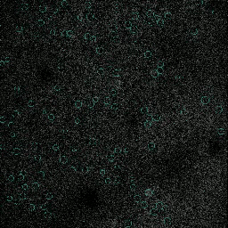

*Raw imaging frames (gray) with cyan ROI circles (Suite2p detected neurons) and red/orange activity heatmap (fluorescence).*

**What you're seeing**: The grayscale background is raw pixel intensity from the actual recording. Overlaid are cyan circles marking detected cell bodies (~10–15 μm diameter in this dataset), and a red/orange heatmap showing each cell's own fluorescence rising and falling over time. Watch individual cells light up and dim at different moments — that's the calcium signal, and it's slow and blurred compared to the instantaneous spikes that caused it.

Two things to notice, each pointing at one of this exercise's problems:
- **Not every cyan circle is a "clean" detection.** Some bright regions are neuropil contamination, not the neuron itself — Exercise 1 removes this contamination, and Exercise 3 explores why finding the cells in the first place is hard.
- **The slow rise and fall you're watching is not the spike train.** It's the *convolved* response — a blurred version of fast, discrete spikes. Exercise 2 is about inverting that blur to recover the original spike times.

This exercise walks through three interconnected problems, in this order:

1. **Neuropil Correction** (Exercise 1) — How do we remove contamination from nearby tissue?
2. **Spike Deconvolution** (Exercise 2) — When did spikes occur, given the slow calcium dynamics we just saw?
3. **ROI Detection** (Exercise 3) — Which pixels belong to which neurons, in the first place?

### Why This Matters

**For neuroscience**: Neurons communicate through spike timing — the precise moments when they fire. Extracting accurate spike times is foundational because it reveals:
- **What neurons encode**: A visual cortex neuron might fire in response to oriented edges. A motor cortex neuron might fire before a specific movement. Without spike timing, you can't answer "what does this neuron do?"
- **How circuits work**: Population activity patterns show whether neurons coordinate (synchronized firing) or compete (mutual inhibition). This reveals circuit function at the network level.
- **How learning happens**: The timing of spikes matters for synaptic plasticity. Spike-timing-dependent plasticity (STDP) is a fundamental learning rule — spikes separated by milliseconds have opposite effects on synapse strength.
- **Disease signatures**: Abnormal spike patterns appear in epilepsy, autism, and neurodegeneration before visible behavioral changes.

In short: **you can't do modern neuroscience without accurate spike times.**

**For you (and your career)**: This exercise teaches the *exact workflow* used in labs worldwide:
- You'll encounter real biological problems (noise, contamination, slow sensor dynamics) that don't appear in textbooks
- You'll design algorithms by understanding tradeoffs (fast but less accurate? slow but precise? what's the right balance?)
- You'll validate your work rigorously — first on synthetic data where you know the ground truth, then on real neurons
- You'll compare yourself against the standard (Suite2p's spike inference) so you understand where your method is competitive and where it falls short
- You'll learn to read and understand scientific code — an essential skill in research

**For AI + science**: You'll see how agentic AI *augments* (not replaces) human understanding:
- When your optimization doesn't converge, ask Cline "Why isn't this working?" It'll suggest debugging steps, explore numerical issues, and help you iterate quickly
- When you encounter new concepts (what's a Toeplitz matrix? why is it useful?), ask Cline for intuitive explanations
- You'll write the *logic* and *math*, but offload boilerplate (building matrices, plotting, I/O) so you stay focused on what matters
- You'll validate implementations: Cline can help test whether your code matches the paper's equations
- **Result**: faster development, deeper understanding, less busywork

### What You'll Build

You'll write **three data-processing pipelines**, each solving one piece of the puzzle:

**Exercise 1: Neuropil Removal** (Warmup)
- **Input**: Raw fluorescence traces (F) and neuropil contamination (Fneu)
- **Output**: Cleaned fluorescence and understanding of how correction works
- **What you'll learn**: How preprocessing works, and how to measure whether it actually worked (correlation between corrected F and Fneu, before vs. after)
- **Real-world parallel**: Every lab applies neuropil correction. This is a standard first step in calcium imaging pipelines.

**Exercise 2: Spike Deconvolution** (Main)
- **Input**: Corrected fluorescence from Exercise 1
- **Output**: Spike times recovered from fluorescence, using a calcium kernel timescale you estimate for each cell
- **What you'll learn**:
  - First, on data you generate yourself: create a fluorescence trace from a spike train with a known timing, then recover it — so you can check whether your method actually works before trusting it on real neurons
  - Then, on real neurons: estimate each cell's own calcium decay time, recover its spikes, and compare against Suite2p's spike inference
- **Key insight**: Suite2p was run with a single fixed decay timescale for every cell in this dataset. Real neurons vary — this exercise estimates that timescale directly from each cell's own data instead.
- **Real-world parallel**: This is the core of calcium-imaging analysis. Getting spikes right determines everything downstream.

**Exercise 3: ROI Detection** (Challenge)
- **Input**: The real 2D field-of-view image (not a per-cell trace — an actual picture of the tissue)
- **Output**: Detected cell locations from a simple threshold-based detector
- **What you'll learn**: Why a simple, single-image threshold approach struggles to distinguish real cells from bright neuropil, and why Suite2p's approach (which exploits activity *dynamics* over the whole movie, not just one static image) does much better
- **Real-world parallel**: Finding neurons is the first step, but it's surprisingly hard. Understanding why teaches you to respect the complexity of biological data.

### By the End

You'll have **three working data-processing pipelines**, each self-contained:
- Code that takes raw imaging → cleaned spikes (the full pipeline)
- Detailed understanding of *why* each step exists (not just "we do it because papers do")
- Quantitative benchmarks showing how your methods compare to the standard (Suite2p)
- Intuition about the tradeoffs in algorithm design (speed vs. accuracy, sensitivity vs. precision)
- Hands-on experience with numerical optimization, inverse problems, and data validation — skills that transfer to any data science problem

---

## Quick Start: Get Set Up on SCC

### Step 1: Access the SCC and Launch VS Code Server

❗ **Browser requirement**: Use **Chrome** or **Safari** for best compatibility with OnDemand and VS Code Server.

Go to: [https://scc-ondemand2.bu.edu/](https://scc-ondemand2.bu.edu/)

Log in with your BU username/password. This opens a web-based interface — no terminal needed.

Once logged in to OnDemand:

1. Click **Interactive Apps** (left sidebar)
2. Click **VS Code Server**
3. Fill in the form with these settings:

   | Setting | Value |
   |---------|-------|
   | **Number of hours** | 6 |
   | **Number of cores** | 1 |
   | **Number of GPUs** | 0 |
   | **Project** | npcr25 |
   | **Additional modules to load** | python3/3.13.8 |
   | **Working Directory** | `/projectnb/npcr25/students/username` |

   ❗ **Important**: Replace `username` with your SCC username (same as your BU login)

4. Click **Launch**
5. Wait for the session to start
6. Click the **VS Code Server** button that appears
7. VS Code opens in your browser — you're now on the SCC with everything pre-loaded!

💬 No Cline yet at this point, so if the OnDemand form or the launch itself is confusing, ask a neighbor or an instructor for now — once Cline is installed in the next step, it's also a fine place to ask "what did I just do, and why?" retroactively.

---

### Step 2: Set Up an AI Coding Assistant

**Cline + Gemini** is the default path below, and what the rest of this guide assumes you're using. Already comfortable with another AI tool — Claude, ChatGPT, etc.? You're welcome to use that instead; skip to Step 3.

### Installation Steps

1. Click on the **Extensions** toolbar item in VSCode and search for **"Cline"** and install.
2. Click on the **"robot"** icon that should appear in the left toolbar to open Cline.
3. Choose **"Bring my own API key"**.
4. For API provider choose **"OpenAI Compatible"**.
5. For Base URL type: `https://generativelanguage.googleapis.com/v1beta/openai/`
6. Navigate to [https://aistudio.google.com/api-keys](https://aistudio.google.com/api-keys) (make sure you are logged in as your personal Google account) and click **"Create API key"**. This will create a project and API key.
7. For OpenAI Compatible API key, copy-paste the key you just created.
8. For model type: `gemini-3.1-flash-lite`

### How to Use Cline

Once installed and configured:
- Open Cline in VSCode (robot icon in left sidebar)
- Paste your code or describe what you need help with
- Ask questions like: "My correlations didn't decrease. What's wrong?" or "Explain neuropil correction"
- Cline will help you debug, explain code, and suggest improvements

💬 Before trusting Cline with anything real, give it a trivial first task — e.g. "print the numbers 1 to 10" — just to confirm the API key and model are actually wired up correctly. Cheaper to catch a setup problem now than mid-exercise.

❗ **Keep Cline in Plan mode until you're actually ready for it to write code.** Cline has a Plan/Act toggle right in its chat box: in Plan mode, it reads files, asks clarifying questions, and lays out what it intends to do — but doesn't touch anything. Switch to Act mode only once its plan actually matches what you want; that's when it starts making edits. Working out the approach in Plan mode first is much cheaper than untangling a multi-file edit you didn't actually want.

### Usage Limits

You get **500 requests per day** with `gemini-3.1-flash-lite`. Check usage at:
[https://aistudio.google.com/rate-limit](https://aistudio.google.com/rate-limit)

If you run out:
- Switch to `gemma-4-26b-a4b-it` (1.5K requests/day, less capable)
- Contact an instructor for unlimited access via our Google Cloud Project

💬 500/day sounds like a lot until you're mid-debug and firing off a request every minute. If you're not sure whether something is worth "spending" a request on, batching a few related questions into one message is usually better than several small back-and-forths.

---

### Step 3: Clone This Repository (via Cline)

Now that Cline is installed, use it to clone the repo.

**In the VS Code terminal**, ask Cline:

> "Clone the repository: https://github.com/depasquale-lab/NPC-SummerSchool-2026-AI-Coding.git"

Cline will execute these commands for you. Then verify it worked by running `ls README.md` in a terminal. You should see the README.md file confirming it cloned successfully.

❗ **Now that it's actually on disk, ask Cline to read this README (`README.md`) in full.** That gives it the full context for everything you'll ask it afterward, instead of guessing from a single pasted snippet.

❗ **This repo does not ship with a `.gitignore`** — right after cloning (before you create `.venv/` in Step 4, or run `git add -A` later) is the moment to fix that. Ask Cline: "Add a `.gitignore` for this project, covering things like the `.venv/` folder, notebook checkpoints, and any large data files." Skipping this is exactly how a multi-hundred-MB `.venv/` folder ends up accidentally committed and pushed.

**Next, create a working branch** for your exercise work. Ask Cline:

> "Create a new git branch for my work. Call it `username`" 

(Replace `username` with your SCC username.) This creates your personal branch where you'll commit your progress. Then confirm with `git branch` in a terminal. 

💬 If "branch," "clone," or "commit" are unfamiliar git vocabulary, ask Cline to explain them using this exact situation as the example — much more concrete than a generic git tutorial.

❗ **Important**: After you complete progress on each exercise, commit and push your work:

```bash
git add -A
git commit -m "Exercise N complete: <brief description>"
git push origin username
```

Pushing after each exercise ensures your work is backed up and instructors can see your progress.

💬 `main` is protected — nobody can push to it directly, including instructors. If `git push` ever errors out with something like "push declined due to repository rule violations," that almost always means you're not actually on your own branch (check with `git branch` — you want to see `* username`, not `* main`). Ask Cline to check what branch you're on and switch you back to it if needed.

---

### Step 4: Set Up Python Environment (via Cline)

Now that Cline is installed, use it to set up your Python environment.

**In the VS Code terminal**, ask Cline:

> "Set up a Python virtual environment for this project. Run these commands:
> ```
> python3 -m venv .venv
> source .venv/bin/activate
> pip install --upgrade pip
> ```
> Then verify it's active by running `which python3` — it should point inside `.venv`."

Cline will execute these commands for you. You should see `(.venv)` in your terminal prompt when done.

❗ **There's no `requirements.txt` handed to you, and that's deliberate — install packages as you actually need them, not all upfront.** Step 0 will be the first time you need anything (numpy, matplotlib); later exercises need a few more (e.g. scikit-learn for Exercise 2's Lasso solver, tifffile for Exercise 3's registered movie). When a cell fails with `ModuleNotFoundError: No module named 'X'`, that's your cue: ask Cline to `pip install X` (with `.venv` active) and re-run the cell. That's a normal, expected part of the workflow — nobody hands you a dependency list before you've written the code that needs it.

💬 If you've never used a virtual environment before and are wondering why we don't just `pip install` directly, ask Cline — it's a good five-minute detour, and understanding it now will save confusion the first time you juggle two projects with conflicting package versions.

---

## Your Work Directory Structure

```
/projectnb/npcr25/students/username/
├── NPC-SummerSchool-2026-AI-Coding/     ← Cloned repo (contains only README.md + assets/)
│   ├── README.md                        ← This guide
│   └── assets/                          ← Images (GIFs, PNGs)
│
├── tutorials/friday_exercises/           ← YOU CREATE with Cline
│   ├── step_0_data_exploration.ipynb
│   ├── exercise_1_neuropil_correction.ipynb
│   ├── exercise_2_spike_deconvolution.ipynb
│   └── exercise_3_roi_detection.ipynb
│
├── my_analysis.py, notes.txt, etc.      ← YOUR work files
│
└── (data accessed from /projectnb2/npcr25/projects/two_photon/.../processed/)
```

💬 Rather than creating these notebooks by hand, ask Cline to set up the `tutorials/friday_exercises/` folder and create empty starter notebooks for each exercise — a natural first real task now that it's installed.

---

## Data Overview

### What You're Looking At

This is a real two-photon calcium imaging recording: a live, awake mouse, imaged through a cranial window, with neurons in layer 2 of cortex expressing a genetically-encoded calcium indicator (jRGECO1a) that gets brighter when a neuron's intracellular calcium rises — which happens when it fires. The raw output of an experiment like this is a video: thousands of grayscale frames, one per timepoint, at 15 Hz.

That raw video has already been run through **Suite2p** (see below) to produce the processed files you'll actually load: cell locations, per-cell fluorescence traces, and a reference set of inferred spike times. You're working from Suite2p's *output*, not the raw video — except in Exercise 3, which also uses the field-of-view image (`ops['meanImg']`). The raw movie exists on disk too, if you're curious (see paths below), but you won't need it for any exercise.

❗ **Use this dataset — everyone should.** `TSeries-03042024-run02-054` is what generated every number, benchmark, and figure in this README. If you use a different dataset, your results won't match what's described here (fine if you're exploring on your own, but the "results should look something like this" sections won't apply).

**Where the data lives**:
- **Processed** (what you'll actually load): `/projectnb2/npcr25/projects/two_photon/Ex1_jRGECO1a_ResonantScanning/processed/TSeries-03042024-run02-054/`
- **Suite2p's spike inference** (your reference in Exercise 2): `/projectnb2/npcr25/projects/two_photon/Ex1_jRGECO1a_ResonantScanning/Suite2P-inferred-spikes/TSeries-03042024-run02-054/`
- **Raw acquisition** (not needed for the exercises): `/projectnb2/npcr25/projects/two_photon/Ex1_jRGECO1a_ResonantScanning/2photon/TSeries-03042024-run02-054/` — the microscope's original output, as multi-gigabyte OME-TIFF files plus acquisition metadata

**Further reading**:
- [Suite2p on GitHub](https://github.com/MouseLand/suite2p) — the pipeline that processed this data
- [Suite2p ROI detection docs](https://suite2p.readthedocs.io/en/latest/roidetection/)
- [Suite2p ROI extraction docs](https://suite2p.readthedocs.io/en/latest/roiextraction/)
- [Suite2p deconvolution docs](https://suite2p.readthedocs.io/en/latest/deconvolution/)

### The Dataset: run02-054

**Recording specs**:
- **Source**: Awake Thy1-jRGECO1a mouse, layer 2 cortex, spontaneous activity
- **125 neurons** × 4535 frames (5.04 minutes @ 15 Hz)
- **90% good quality** (113 cells with `iscell[:, 0] == 1`)
- **Cell size**: detected cell bodies are ~10–15 μm in diameter (measured from this dataset's own ROIs); pixels are ~0.4 μm
- **Well-characterized**: diverse cell types and firing rates

### What is Suite2p?

[**Suite2p**](https://github.com/MouseLand/suite2p) is the industry-standard software for processing two-photon imaging data. It's maintained by the Stringer Lab and used in hundreds of neuroscience papers worldwide.

**What Suite2p does**:
1. **ROI detection** ([docs](https://suite2p.readthedocs.io/en/latest/roidetection/)): Suite2p offers three detection algorithms, selected by an `algorithm` setting: **Sparsery** (the default), Sourcery, and Cellpose. Sparsery is a matrix decomposition that looks for spatially-compact, temporally-sparse sources directly in the movie (i.e. it exploits *when* and *where* fluorescence changes over time, not just a single static image) — this is the method that produced the ROIs in this dataset. Cellpose, by contrast, is a deep-learning anatomical segmentation model that works on a static summary image, not the movie — it's an available option, but was **not** used here.
2. **Fluorescence extraction** ([docs](https://suite2p.readthedocs.io/en/latest/roiextraction/)): Measures raw fluorescence (F) from each detected ROI
3. **Neuropil measurement** ([docs](https://suite2p.readthedocs.io/en/latest/roiextraction/)): Measures fluorescence (Fneu) from the surrounding neuropil tissue
4. **Spike inference** ([docs](https://suite2p.readthedocs.io/en/latest/deconvolution/)): Applies its OASIS-based spike inference algorithm to recover spike times from fluorescence
5. **Quality scoring**: Assigns a quality-of-detection index to every cell, rating confidence that each ROI is a real neuron

The result is a folder full of `.npy` files containing all the processed data.

💬 If any of Sparsery, OASIS, or "neuropil mask" is unfamiliar jargon, ask Cline to explain it before you get to the exercise that depends on it — much easier to build on a concept you already have some grip on than to learn it and implement it in the same sitting.

### The Files You'll Load

**All the data in this exercise has already been processed by Suite2p.** You're not reimplementing Suite2p — you're learning how its pieces work by implementing and validating them yourself. Here's what each file contains:

**`F.npy`** — **Raw fluorescence** from each detected ROI
- Shape: 125 cells × 4535 frames
- What it is: The sum of all photons detected in each ROI during each frame
- Range: ~170–5550 counts/frame (varies across cells and time)
- Why you need it: This is the actual measurement you'll work with. It's noisy, slow (calcium dynamics), and contaminated (neuropil signal mixed in)
- ⚠️ **This is genuinely uncorrected — Suite2p never saves a neuropil-corrected version of `F` anywhere.** It does compute one internally (`Fc = F - neucoeff × Fneu`), right before running its own spike deconvolution — that's the `Fc` passed to `dcnv.oasis()` mentioned in Exercise 2. So Suite2p's own `spks.npy` benchmark *is* based on corrected fluorescence, but the corrected trace itself is used once and discarded, never written to disk. `F.npy` is the same raw input Suite2p itself started from.
- ⚠️ There's also an `F_chan2.npy` and `Fneu_chan2.npy` in this same directory — a second imaging channel that was never actually recorded, so both are all-zeros (confirmed). Load `F.npy`/`Fneu.npy`, not the `_chan2` versions.

**`Fneu.npy`** — **Neuropil fluorescence** (the contamination signal)
- Shape: Same as F (125 cells × 4535 frames)
- What it is: Fluorescence from the tissue surrounding each ROI, measured from a surround mask (padded around the ROI, excluding other detected cells)
- Range: ~350–3730 counts/frame (often as bright or brighter than the cell signal!)
- How Suite2p measures it ([docs](https://suite2p.readthedocs.io/en/latest/roiextraction/)): For each ROI, Suite2p builds a "neuropil mask" by: (1) padding the ROI outward by a fixed number of pixels to exclude the cell itself, (2) growing a rectangular (or circular, if configured) region until it contains enough non-cell pixels, (3) excluding pixels belonging to other detected ROIs, and (4) averaging fluorescence across these neuropil pixels
- Why you need it: This is the contamination you'll remove in Exercise 1. By measuring Fneu separately, Suite2p gives you a direct estimate of the neuropil signal contaminating F. Without correction, ROIs show much higher correlation with each other due to spatially-invariant neuropil surges affecting all cells simultaneously. The correction Suite2p applied to this dataset is **F' = F - 0.7 × Fneu**. ✅ Suite2p's own documentation shows 0.7 as the example `neucoeff` value, and this specific recording's saved `ops.npy` settings confirm 0.7 is exactly what Suite2p used when it originally processed this dataset — not a guess based on the documentation's example.

**`iscell.npy`** — **Cell quality scores**
- Shape: 125 cells × 2 columns
- ✅ Contains: **column 0 is the final binary cell/not-cell decision** (0 or 1 — verified: this dataset's column 0 has only these two values), and **column 1 is Suite2p's underlying continuous classifier probability** that the ROI is a real cell — not the other way around, which is a common mix-up.
- Threshold: Use `iscell[:, 0] == 1` to filter for the 113 ROIs treated as real cells throughout this README. (You'll sometimes see this written as `iscell[:, 0] >= 0.15` — mathematically identical since column 0 only ever takes the values 0 or 1, but write `== 1` if you want the intent to be unambiguous.)
- ⚠️ Column 0 here is **not** simply "column 1 thresholded at 0.5": 113 ROIs have `iscell[:, 0] == 1`, but only 93 have `iscell[:, 1] >= 0.5` — the two disagree on 20 ROIs. That gap is consistent with column 0 reflecting a human's final call (likely adjusted from the raw classifier during curation), not just the automated probability. Column 0 is the one used as ground truth throughout every exercise in this README.
- Why you need it: Not all detected ROIs are real neurons. Some are neuropil artifacts or background noise. Column 0 is how you distinguish real cells from false detections. At this dataset's actual curated cutoff, you keep 113 of 125 cells (90.4%).

**`spks.npy`** — **Suite2p's spike inference** (the reference you'll compare against)
- Shape: 125 cells × 4535 frames
- What it is: Spike amplitudes recovered by Suite2p's OASIS-based spike inference algorithm, run with a single fixed calcium timescale (τ = 1.0s) for every cell
- Range: 0–1543. Note this is **not** a sparse 0/1 spike train — many frames have small nonzero values, so a raw ">0" threshold captures far more than just "obvious" spike events. Comparing against it requires peak-detection, not simple thresholding.
- Why you need it: This is your benchmark. After you implement deconvolution in Exercise 2, you'll compare your spike detections against this reference.
- ⚠️ **Location note (important, easy to get wrong)**: There's also a `spks.npy` sitting right next to `F.npy` in the processed directory — but that one is **all zeros** (confirmed: same shape, 125×4535, every value 0). The real spike inference you want is in a separate directory: `/projectnb2/npcr25/projects/two_photon/Ex1_jRGECO1a_ResonantScanning/Suite2P-inferred-spikes/TSeries-03042024-run02-054/spks.npy`. If your comparison in Exercise 2 looks completely broken, check you didn't accidentally load the zeroed-out copy.

**`stat.npy`** — **ROI metadata**
- Shape: 125 cells
- What it contains: For each ROI — pixel coordinates (`xpix`, `ypix`), median location (`med`), size (`npix`), and other shape descriptors
- Why you need it: To visualize where cells are in the image, filter by size/location, or (in Exercise 3) compare your own detections against Suite2p's ROI positions

**`ops.npy`** — **Processing parameters and the field-of-view image**
- Contains Suite2p's run configuration (frame rate, neuropil coefficient, kernel timescale, etc.) plus `ops['meanImg']` — the actual 2D mean fluorescence image of the field of view (1024×1024 pixels for this dataset)
- Why you need it: This is what Exercise 3 uses as the "picture" to detect cells in. **`F.mean(axis=1)` is not a substitute** — F is already one trace per detected cell, not spatial pixel data.

### How You'll Compare to Suite2p

In each exercise, you'll implement a piece of the Suite2p pipeline and validate it:

- **Exercise 1**: You'll apply Suite2p's own neuropil correction (α = 0.7) and measure how much it reduces contamination.
- **Exercise 2**: You'll implement L1-regularized deconvolution with per-cell calcium kernels. Suite2p uses a different algorithm (OASIS) with one fixed kernel for every cell. You'll compare your spikes against Suite2p's and measure agreement.
- **Exercise 3**: You'll write a simple single-image threshold detector. Suite2p's default detects cells using movie dynamics (Sparsery), not a single static image. You'll see why that distinction matters.

**The goal**: Not to beat Suite2p (it's already well-engineered), but to understand how it works and develop intuition for algorithm design. When you later use Suite2p for your own research, you'll know exactly what it's doing under the hood.

### Loading Data in Python

```python
import numpy as np
from pathlib import Path

# Shared data directory with processed outputs
data_dir = Path('/projectnb2/npcr25/projects/two_photon/Ex1_jRGECO1a_ResonantScanning/processed')
run_dir = data_dir / 'TSeries-03042024-run02-054'

# Load fluorescence and cell info from processed directory
F = np.load(run_dir / 'F.npy')              # (125, 4535) — raw fluorescence
Fneu = np.load(run_dir / 'Fneu.npy')        # (125, 4535) — neuropil fluorescence
iscell = np.load(run_dir / 'iscell.npy')    # (125, 2) — cell quality scores
stat = np.load(run_dir / 'stat.npy', allow_pickle=True)  # (125,) — ROI locations
ops = np.load(run_dir / 'ops.npy', allow_pickle=True).item()  # dict — run config + meanImg

# Load Suite2p's spike inference from a separate directory
spks_dir = Path('/projectnb2/npcr25/projects/two_photon/Ex1_jRGECO1a_ResonantScanning/Suite2P-inferred-spikes')
spks = np.load(spks_dir / 'TSeries-03042024-run02-054' / 'spks.npy')  # (125, 4535)

# Filter by quality (column 0 is the binary cell/not-cell decision)
good_cells = iscell[:, 0] == 1
F_good = F[good_cells, :]
Fneu_good = Fneu[good_cells, :]

# Counts after quality filtering
print(f"Total cells: {F.shape[0]}")
print(f"Good cells: {F_good.shape[0]} ({100*F_good.shape[0]/F.shape[0]:.1f}%)")
print(f"Frames: {F.shape[1]} ({F.shape[1]/15/60:.1f} minutes at 15 Hz)")
```

---

# The Exercises: Warmup → Main → Challenge

❗ **These exercises are designed for students new to Python and data analysis**. They guide you through real research pipelines step-by-step. Do them in **Python** — that's what every scaffolding step, notebook, and file format in this guide assumes.

❗ **If you're not a strong coder, that's completely fine — it's the point.** These exercises are as much about learning to work *with* an AI coding assistant as they are about the neuroscience. You don't need to already know how to build a Toeplitz matrix or run `scipy.ndimage.label` before you start — you need to be able to describe what you're trying to do, read Cline's code well enough to sanity-check it against the results below, and ask follow-up questions when something doesn't make sense. Not understanding a line of code yet is exactly the situation Cline is there for, not a sign you're behind.

**If you already know Python/data science**: Feel free to use your own approaches! Work with different data, implement advanced variants, parallelize code, or extend the exercises. Use any AI tool you prefer (Cline, Claude, ChatGPT, etc.) — the goal is learning the neuroscience and algorithms, not following a script.

---

This exercise has **three parts, designed to build from simple to complex** — plus a Step 0 to get oriented first:

0. **Step 0**: Load the data and look at it — no analysis yet
1. **Exercise 1 (Warmup)**: Neuropil Removal — apply correction, compute metrics, visualize
2. **Exercise 2 (Main)**: Spike Deconvolution — solve inverse problem, estimate kernels per-cell, compare to Suite2p
3. **Exercise 3 (Challenge)**: ROI Detection — understand why movie dynamics beat a static-image threshold

You can do all three, or focus on Exercise 2 for depth.

---

## Step 0: Look at the Data First

Right now, everything you know about this dataset is secondhand — you've read descriptions of what F.npy contains, what a neuropil mask is, what Suite2p's ROIs look like, but you haven't actually opened a single file yourself. That gap matters: the exercises ahead ask you to reason about correlations dropping, spikes overlapping, detections missing — and it's much easier to reason about those things once you've seen what the raw material actually looks like with your own eyes, rather than trusting a description of it.

So before Exercise 1, take a few minutes to just load the files and look at them. There's nothing to get "right" here — no metric, no benchmark, no deliverable to score. The point is purely to get oriented: to see that a "cell" in this dataset is a noisy, wandering trace rather than a clean signal, and that the "picture" Suite2p worked from is a grainy, speckled field of view where the cells aren't even obviously the brightest thing in frame. Once you've seen that, the problems the three exercises are solving will make a lot more intuitive sense, and you'll have a mental picture to check your own results against as you go.

**Deliverable**: Load `F`, `Fneu`, and `ops['meanImg']`. Plot a few raw fluorescence traces over time, and plot the mean image with cell locations marked (from `stat`, the `med` field).

💬 Not sure how to load an `.npy` file, or what `ops['meanImg']` even is? Ask Cline — that's exactly what it's there for.

**What you should see**:

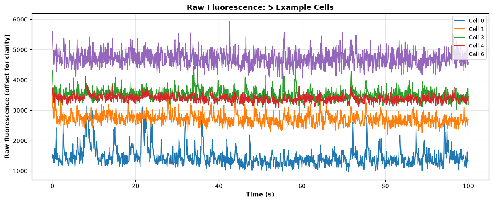

*A few cells' raw fluorescence over 100 seconds. Notice the slow rises and falls — not sharp spikes. That slowness is the whole problem Exercise 2 solves.*

💬 Not sure if your traces look "normal"? Describe what you're seeing to Cline and ask whether that looks like reasonable two-photon calcium data — a low-stakes sanity check before you've built any intuition of your own.

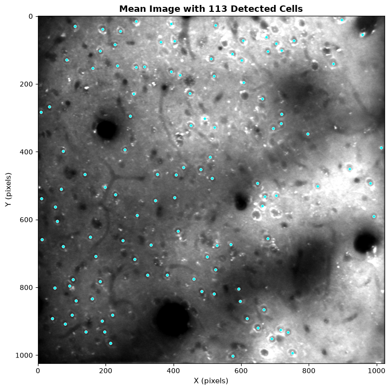

*The actual field of view, averaged over the whole recording, with cyan dots marking Suite2p's detected cells. A grainy grayscale image with round bright blobs, dark blood-vessel-like curves, and dots landing on most (not all) of the bright blobs.*

💬 Curious what other fields live in `stat`, or what a "median location" means for an irregularly-shaped ROI? Ask Cline to explain — no pressure to fully understand `stat.npy` yet, but it's worth poking at while there's nothing riding on it.

If your plots look roughly like this, you're oriented and ready for Exercise 1.

❗ **Commit your progress** before moving on — this is a natural checkpoint. Ask Cline: "Show me `git status`, then commit this with a message describing what Step 0 actually did." Having Cline check `git status` first (not just commit blindly) is worth doing every time — it's your chance to notice anything unexpected staged for commit, like a `.venv/` folder that slipped past your `.gitignore`.

---

## Exercise 1: Neuropil Removal (Warmup)

### The Problem

Fluorescence measured from a cell body comes from **two sources**: the cell itself (signal) and the surrounding tissue — dendrites, glia, other cells (contamination). Light from that surrounding tissue bleeds into your measurement because the microscope's optics aren't perfectly sharp: even a well-focused lens can't draw a perfectly crisp boundary around one cell, so some photons that actually originated just outside the ROI still land on the same pixels the ROI is being measured from.

That physical fact is what makes the model below a simple *sum* rather than something more complicated. Fluorescence is just a count of detected photons per frame, and photon counts from different, unrelated sources add together with no interaction — light from the cell and light that leaked in from the surrounding tissue don't combine in any fancier way, they just land on the same detector pixels together. So whatever comes out as the measured value is: photons from the cell, plus photons that leaked in from neuropil, plus ordinary measurement noise.

The one wrinkle is the α in front of the neuropil term. `Fneuropil`, as Suite2p measures it, is the average fluorescence over a ring of pixels *surrounding* the ROI — not literally the photons that leaked into the ROI's own pixels. A brighter surround generally means more contamination, but the two aren't on the same scale (the ROI is only picking up a fraction of what the full surrounding ring is emitting), so the model needs a scaling factor, α, to convert "average brightness of the surrounding ring" into "how much of that actually reaches this specific ROI":

$$F_{\text{obs}} = F_{\text{cell}} + \alpha \times F_{\text{neuropil}} + \text{noise}$$

💬 If that notation is more confusing than helpful, ask Cline to restate it in plain language, or to walk through what happens to one single frame's value as you subtract more and more neuropil.

Without correcting for this, a burst of activity in the surrounding tissue can look like activity in your cell — even if the cell did nothing.

**How Suite2p estimates the contamination**: You can't separate "cell" from "neuropil" within the ROI's own pixels, so Suite2p measures the neuropil separately, from pixels just outside the ROI (excluding any other detected cells). This gives `Fneu` — an estimate of the same contaminating signal that's leaking into `F`. That's why subtracting a scaled copy of it (`F - α × Fneu`) removes the contamination.

### The Existing Solution

Suite2p measured this dataset's neuropil and applied this correction ([docs](https://suite2p.readthedocs.io/en/latest/roiextraction/)):

$$F_{\text{corrected}} = F_{\text{obs}} - 0.7 \times F_{\text{neuropil}}$$

✅ α = 0.7 (Suite2p calls this `neucoeff`) is exactly what this recording's saved `ops.npy` settings show Suite2p actually used when it originally processed this dataset — not a guess or an approximation. You'll apply that same correction and measure how well it works.

### Deliverable

Apply `F_corrected = F - 0.7 * Fneu` to the good-quality cells (`iscell[:, 0] == 1`), then show it worked.

**What "showing it worked" actually means here**: for each cell, you have two time series — its own fluorescence and its neuropil estimate. If contamination is real, those two should rise and fall together, since the same neuropil brightness is leaking into both — so *before* correction, `F` and `Fneu` should be correlated over time. That correlation is a direct, checkable proxy for "how much of this cell's trace is actually just neuropil bleeding through," not a measurement of anything biological. Compute the Pearson correlation between `F[i]` and `Fneu[i]` for each cell, do the same between `F_corrected[i]` and `Fneu[i]`, and average each set across cells — the correction "worked" exactly to the extent that average correlation drops.

Report the correlation between F and Fneu before vs. after correction, and plot a few example cells.

⚠️ Compute the correlation **per cell, then average** — not by pooling every cell's data into one big correlation. Pooling mixes in brightness differences *between* cells (which the correction can't fix) and makes the contamination look worse than it is.

💬 If your correlation isn't dropping the way you'd expect, describe what you're seeing to Cline and ask it to help you debug — this is a common place to get stuck on an off-by-one or an unintended broadcast.

**Results should look something like this** (this dataset):
- Mean per-cell correlation: **0.44 → -0.13** (a **71.6%** reduction)
- The correction overshoots slightly rather than landing exactly on zero — an honest result, not a claim that α = 0.7 is perfect for every dataset
- Corrected traces look visibly cleaner, with sharper individual events

### What Your Results Might Look Like

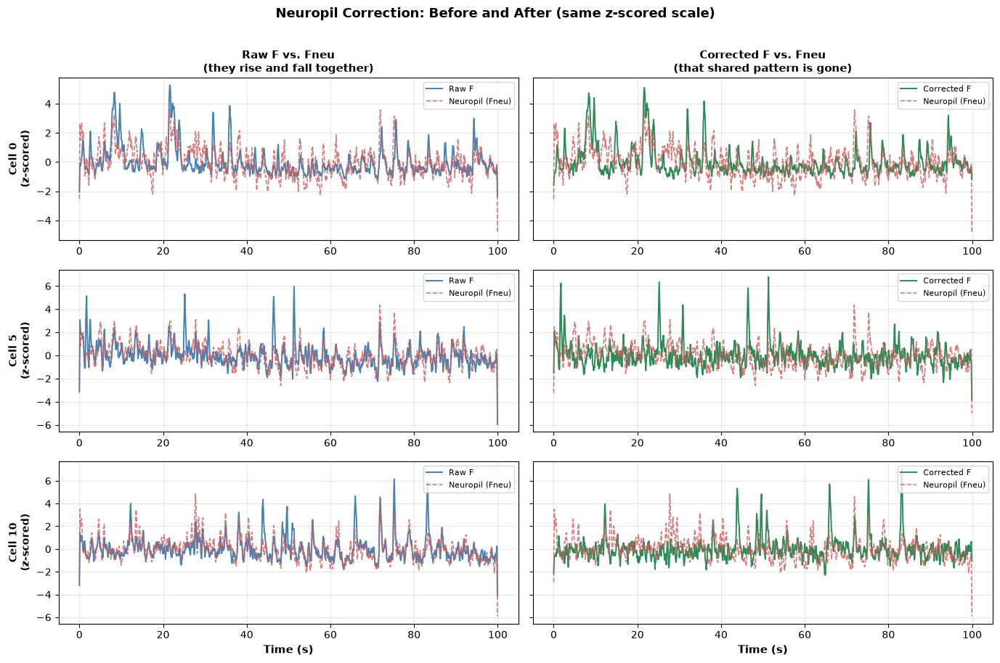

*Three example cells (rows), each shown two ways on the same z-scored scale: raw F vs. Fneu (left) and corrected F vs. Fneu (right). In the left column, the background wobble in blue tracks the red dashed neuropil trace closely. In the right column, that shared wobble is largely gone — the sharp transients that remain in green are essentially independent of Fneu.*

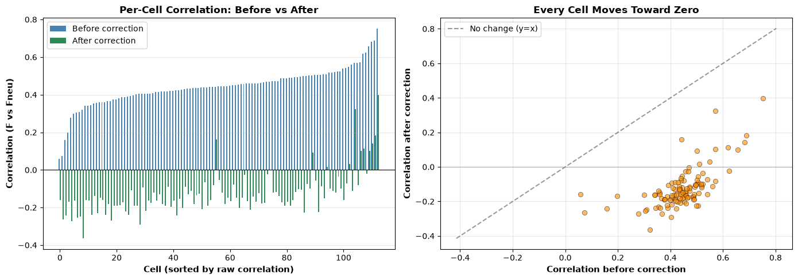

*Every one of the 113 good cells, not just the average. Left: each cell's own F-vs-Fneu correlation before (blue) and after (green) correction, sorted by the raw value. Right: the same data as a scatter — every point falls below the y=x line, meaning the correction reduces correlation for every single cell, not just on average.*

💬 Once you have your own version of this plot, ask Cline what it would expect to see if the correction had failed completely, or worked perfectly — then compare that to what you actually got. That contrast is a good way to build intuition for what "partial correction" (our real result here) actually means.

❗ **Commit and push your progress** before starting Exercise 2. Ask Cline: "Commit my Exercise 1 work with a descriptive message, then push it to my branch." If anything about your `.gitignore` feels uncertain, this is a good moment to ask Cline to double-check `git status` first — better to catch a stray file now than after it's already pushed.

---

## Exercise 2: Spike Deconvolution (Main)

### The Problem

Calcium indicators respond **slowly** to spikes. A single spike (~1 ms) triggers a fluorescence rise over 10–100 ms that decays over 100–1000 ms. When neurons fire in bursts, those slow responses overlap and individual spikes become invisible in the raw trace.

Two physical facts explain exactly why the model below has the shape it does. First, why a *sum of shifted copies* of the same shape: every spike triggers the same stereotyped calcium transient, just starting at that spike's own time $t_s$ — and because calcium from an earlier spike hasn't fully cleared before a later one arrives, the fluorescence at any moment is the total contribution from *every* spike that's fired recently, added together. That's what $\sum_{\text{spikes}} h(t - t_s)$ means: take the same pulse shape $h$, shift a copy of it to start at each spike time, and add them all up.

Second, why that pulse shape is a decaying exponential: after a spike, calcium floods in almost instantly (the fast rise), and then the cell pumps and buffers it back out at a rate proportional to how much *excess* calcium is currently present — more excess means faster removal, less excess means slower removal. That kind of "rate of decrease proportional to the current amount" process is exactly what produces exponential decay mathematically, which is why $h(t) = \exp(-t/\tau)$ is the standard model, not an arbitrary curve-fit. $\tau$ is just the characteristic timescale of that decay (how long it takes to fall to about 37% of its peak) — it depends on the specific calcium indicator and, as you'll see, can genuinely vary cell to cell.

$$F(t) = \text{baseline} + \sum_{\text{spikes}} h(t - t_s) + \text{noise}, \qquad h(t) = \exp(-t/\tau)$$

This is written for **one neuron's trace at a time** — $F$, $s$, and $H$ below all describe a single cell. You'll solve this inverse problem separately for every cell, each with its own kernel; it's never one large joint problem across every cell in the recording at once. (Even Suite2p's own OASIS call, which batches every cell's trace into a single function invocation for speed, still deconvolves each cell's trace independently — the only thing shared across cells there is the one fixed τ, not the deconvolution itself.)

Given the observed $F(t)$, you must **invert** this to recover the spike times — concretely, minimize $\frac{1}{2n}\|F - Hs\|_2^2 + \lambda\|s\|_1$ subject to $s \geq 0$, where $n$ is the number of frames (dividing by it turns the error term into a mean-squared-error per frame, so one $\lambda$ works reasonably regardless of trace length — this is exactly what `sklearn.linear_model.Lasso`'s `alpha` parameter does internally, which is the same $\lambda$ you'll pass to it in the scaffolding below) and $H$ is the Toeplitz convolution matrix built from the kernel.

**One clarification worth making explicit now, because it shapes everything downstream**: neither Suite2p's OASIS nor the method you'll build actually outputs a "spike happened here: yes/no" signal. What comes out — Suite2p's `spks.npy`, and your own recovered $s$ — is a continuous **spike amplitude** at every frame: a number meant to represent roughly how much spiking activity contributed to that frame, not a discrete event. It can be exactly zero (no activity), small (a little residual uncertainty about where a nearby spike's mass belongs), or large (one spike, or several spikes close enough together to blend into one frame). This is exactly why you'll need an *extra* step (finding peaks in that continuous output) to get discrete spike times out of it — the raw deconvolution doesn't hand you events, it hands you a curve you still have to interpret. It's also why Deliverable 2 compares your output and Suite2p's output by *correlating two continuous traces* rather than counting matched discrete events: both are estimates of the same underlying continuous quantity, not two lists of binary spikes to line up.

💬 "Invert this" is doing a lot of work in one sentence. If it's not obvious why this is hard — why you can't just look at where $F(t)$ jumps up — ask Cline to explain what happens when two spikes fire close together and their two exponential decays add on top of each other. Seeing that overlap concretely is most of the intuition you need for the rest of this exercise.

### The Existing Solution

Suite2p's algorithm, **OASIS** ([docs](https://suite2p.readthedocs.io/en/latest/deconvolution/)), assumes exponential decay and runs non-negative deconvolution in milliseconds per cell. Its own function signature is `dcnv.oasis(F=Fc, batch_size=batch_size, tau=tau, fs=fs)` — `F` there is the *entire array of traces for every cell in the recording*, and `tau` is passed once, as a single scalar, for that whole call. It's a global setting for the recording, not something computed per cell. ✅ This recording's saved `ops.npy` settings confirm Suite2p was actually run on it with **one fixed τ = 1.0s for every cell** — a simplification, since real neurons don't all share identical calcium kinetics.

**This isn't a problem unique to Suite2p, or invented for this exercise.** The other major calcium-imaging pipeline, **CNMF** ([Pnevmatikakis et al.](https://github.com/epnev/constrained-foopsi), implemented in [CaImAn](https://caiman.readthedocs.io/en/latest/core_functions.html)), solves essentially the same inverse problem in its `constrained_foopsi` deconvolution step: minimize total spike mass (a sparsity-promoting objective, the same role your L1 penalty plays), subject to non-negativity and the reconstruction fitting the trace within its noise level. OASIS was originally developed as a much faster, *exact* solver for that same constrained problem, before Suite2p adopted it as its default. So the inverse problem you're solving by hand in this exercise isn't a simplified toy version of something real methods do differently — it's the actual mathematical core that both major pipelines (Suite2p and CNMF/CaImAn) build their spike inference around. OASIS and your Lasso solver are two different algorithms for solving that same problem, not two different problems.

**Why not just reimplement OASIS?** OASIS is a specialized, carefully optimized algorithm from its own dedicated research codebase — reproducing it exactly is a substantial engineering project on its own, not what this exercise is asking of you. Instead, you'll solve the *same underlying inverse problem* — recover spikes from a blurred fluorescence trace — with a simpler, more general tool (L1-regularized least squares) that you can build from first principles. That's the point: understanding the problem OASIS solves and building a working (if less polished) solution yourself, not reproducing OASIS's internals.

**Your task**: solve the same inverse problem explicitly, using a kernel timescale you estimate separately for each cell.

### Deliverable 1 — Synthetic Validation

**Method**: Generate a spike train from a Poisson process (~1 Hz, with a refractory period so spikes don't land right on top of each other), convolve it with an exponential calcium kernel (τ = 1.0s) to make synthetic fluorescence, and add shot + Gaussian noise. Recover the spikes by solving the inverse problem, then score sensitivity/precision/F1 against the ground truth you made.

**Scaffolding for the L1 (Lasso) solve** — this is the part most likely to trip you up, so here's the concrete shape of it:

1. Build the kernel as a 1D array: `h = np.exp(-t_kernel / tau)`, where `t_kernel` covers ~5τ worth of frames (long enough for the exponential to decay to near zero).
2. Convolve your spike train with the kernel to generate synthetic fluorescence, using `np.convolve(spikes, h, mode='full')[:n_frames]` — **not** `mode='same'` (see the ⚠️ below; this one is a real pitfall, not a style choice).
3. Build the Toeplitz convolution matrix $H$ (shape `n_frames × n_frames`), where each column is the kernel shifted down by one frame: for `i in range(n_frames)`, for `k in range(len(h))`, set `H[i+k, i] = h[k]` (skip if `i+k >= n_frames`). Column `i` of $H$ is "what the fluorescence looks like if there's exactly one spike at frame `i`" — multiplying $H$ by a spike vector $s$ gives you back a fluorescence trace.
4. Subtract off the baseline from your fluorescence (`F - F.min()`, or similar) so the target you're fitting against starts near zero, matching what $Hs$ produces for an all-zero spike train.
5. Fit `sklearn.linear_model.Lasso(alpha=..., positive=True).fit(H, F_baseline_subtracted)`. The `.coef_` attribute *is* your recovered spike-amplitude vector $s$ — no separate "solve" step needed beyond this one `.fit()` call.
6. `alpha` controls sparsity: start small (e.g. `0.002` for data on the ~100-count scale) and adjust. All-zero output → `alpha` too large. Way more nonzero entries than plausible spikes → `alpha` too small.
7. Find discrete spike times with `scipy.signal.find_peaks(s, height=s.max() * 0.15, distance=...)` — a height relative to that trace's own max, not an absolute number, since amplitude scale varies.

⚠️ Three things that will silently break this — the first one is the sneakiest, because everything still *runs*, it just quietly recovers much worse spikes:
- **Generate the synthetic fluorescence with a causal convolution, matching $H$.** `np.convolve(spikes, h, mode='same')` **centers** the kernel around each spike, so the spike's effect leaks *backward* in time too. But $H$ (above) is built causally — a spike at frame $i$ only ever affects frames $i, i+1, i+2, \ldots$, never anything before $i$. If your synthetic data generator and your $H$ matrix disagree about this, every recovered spike lands a few frames away from where it actually should, and it looks like scattered false positives and false negatives — not an obviously "wrong" result, just a much worse one. Use `mode='full'` and truncate to `n_frames`, not `mode='same'`.
- **Use a non-negative Lasso**, not `scipy.optimize.nnls` plus a smoothness penalty. Here's concretely what the two penalties do to the recovered vector $s$, since "L1 vs. smoothness" is easy to wave your hands at and hard to actually picture:
  - **L1 penalty** ($\sum |s_i|$, what Lasso minimizes): the cheapest way to shrink this is to push individual entries of $s$ to exactly zero. It has no preference for *which* entries — it just wants as few nonzero entries as possible, each carrying whatever amplitude it needs. That matches a real spike train: long stretches of exact zero, punctuated by isolated nonzero frames.
  - **Smoothness penalty** ($\sum (s_i - s_{i-1})^2$, a differencing penalty): the cheapest way to shrink *this* is to make neighboring entries similar to each other. Applied to a true spike — one frame with value 1, its neighbors at 0 — this penalty is minimized by *spreading that 1 out* across several neighboring frames instead (e.g. three frames at ~0.33 each has smaller squared differences than one frame at 1 next to zeros). The penalty is structurally rewarded for blurring exactly the sharp jump you're trying to recover.
  
  That blurring is the literal mechanism behind why a smoothness penalty produces smeared, hard-to-read output instead of clean, isolated spikes — it isn't a minor implementation detail, it's the whole reason the earlier (worse) version of this exercise looked messy.
- **Match peaks, not frames.** The recovered trace spreads across several frames around each real event. Find peaks in it and match each to the nearest true spike within a small tolerance window — comparing frame-by-frame manufactures false positives out of one event's own shoulders.

💬 If "the L1 penalty prefers sparsity, the smoothness penalty prefers blurring" is still abstract, ask Cline to run both penalties on the same tiny example — say, a single isolated spike, `s = [0, 0, 1, 0, 0]` — and show you what each one's minimizer actually looks like. Seeing the two outputs side by side on one spike is much more convincing than any explanation in prose.

💬 This is also the most mathematically involved exercise overall — if the inverse problem or the Toeplitz matrix itself doesn't click, ask Cline to walk through it with a concrete small example (3 spikes, a short kernel). Also a good exercise to ask Cline to help tune `alpha` if your solver returns all zeros or way too many spikes.

### Deliverable 2 — Real Data

**Data**: Use a subset of run02-054 — e.g. the first 30 good-quality cells and the first 2000 frames (~2.2 minutes). The deconvolution below solves an $n_{\text{frames}} \times n_{\text{frames}}$ system per cell, so runtime grows fast with both cell count and frame count; a subset keeps this tractable. The benchmarks below were measured on exactly this subset — running on the full 113 cells × 4535 frames will work but will be much slower, and your numbers may shift somewhat since more/different cells are included.

**Method**: For each cell in your subset, estimate its own τ from the autocovariance of its fluorescence trace — for exponential decay, $\text{acov}[\text{lag}] \propto \gamma^{\text{lag}}$ where $\gamma = \exp(-1/(\tau \cdot \text{frame\_rate}))$, so fit $\log(\text{acov})$ vs. lag over several lags (a single two-point ratio is too noisy for one real trace) and don't assume Suite2p's fixed 1.0s applies to every cell. Deconvolve real fluorescence with that cell's own kernel using the same Lasso approach as Deliverable 1 (note: `alpha` will likely need to be much larger here — real fluorescence is on a much bigger absolute scale than the synthetic data).

💬 If "autocovariance" and "fitting the decay slope" feel like a black box, ask Cline to generate a synthetic exponential-decay trace with a known τ and walk through recovering that τ step by step — much easier to trust the method on real cells once you've seen it recover a number you already know is correct.

Then compare against Suite2p's spike inference (`spks.npy`) — but **not** with sensitivity/precision/F1. Suite2p's own documentation doesn't define any threshold for turning its continuous output into discrete spike events; it's meant to be used as a continuous trace. Inventing your own threshold just to force a sensitivity/precision number would mean that number partly reflects your arbitrary threshold choice, not real agreement between the two methods. Instead, **correlate the two continuous traces directly**, per cell — no threshold needed.

**Results should look something like this** (this dataset):
- **Deliverable 1 (synthetic, SNR ≈ 3)** — scored with sensitivity/precision/F1 against the ground truth *you generated*: F1 ≈ 0.81 (sensitivity 70%, precision 97%) — good but not perfect. Precision is high (few false alarms), sensitivity is lower (some real events still get missed) — noisy, overlapping transients are still a genuinely hard problem, just not an intractable one once the forward/inverse models actually agree on alignment.
- **Deliverable 2 (real data)** — no ground truth here, so scored by correlation instead: per-cell τ ranges ~0.17–2.3s, median ≈ 0.41s — clearly not one-size-fits-all, and mostly below Suite2p's fixed 1.0s. Correlation with Suite2p's spike inference: mean r ≈ **0.81**, median ≈ **0.85** across 30 cells, with 29/30 cells above r = 0.5 — strong agreement despite the two methods using completely different algorithms.

### What Your Results Might Look Like

**Synthetic validation (Deliverable 1):**

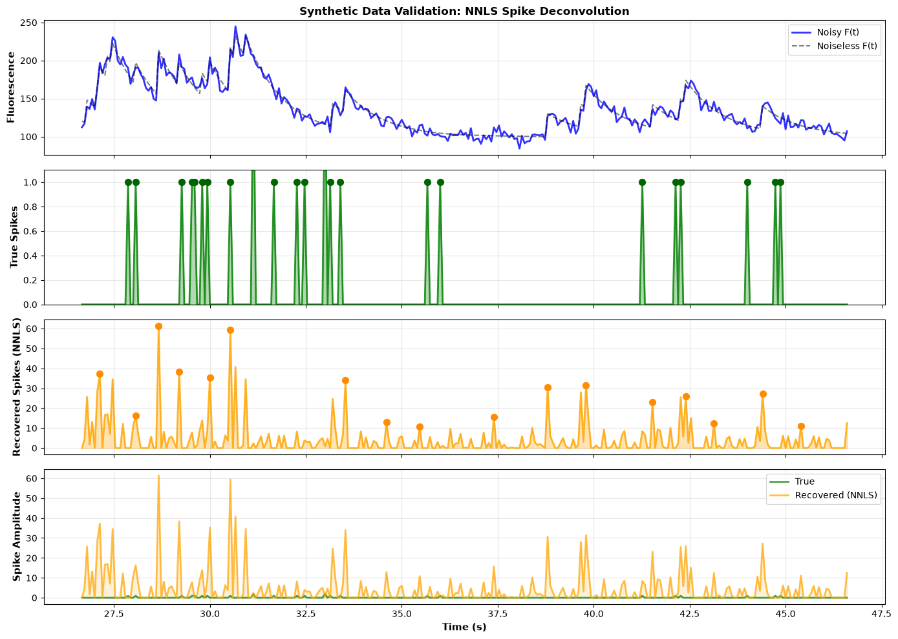

*Top: noisy vs. noiseless synthetic fluorescence. Middle two rows: true spikes vs. recovered spikes, on their own natural scales. Bottom: the recovered trace with true spike times marked as vertical dashed lines — deliberately not plotted on a shared amplitude axis with the (binary) true spikes, since that would make the true spikes invisible. Recovery is good but not exact — most dashed lines land right on a recovered peak, a handful of true spikes are missed, and a few small spurious peaks remain — consistent with F1 ≈ 0.81.*

**Per-cell kernel estimation (part of Deliverable 2):**

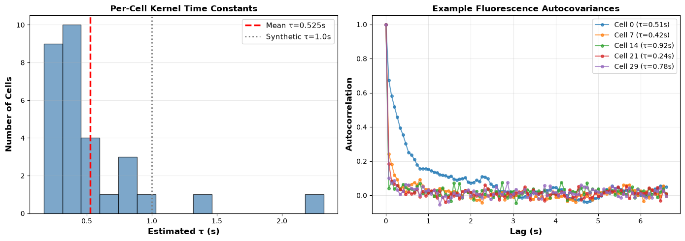

*Left: distribution of estimated τ across 30 real cells, compared to the τ = 1.0s Suite2p used for all of them. Right: example autocovariance curves showing the decay used to fit each cell's τ.*

**Real data comparison (Deliverable 2):**

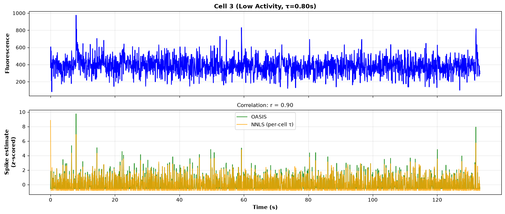
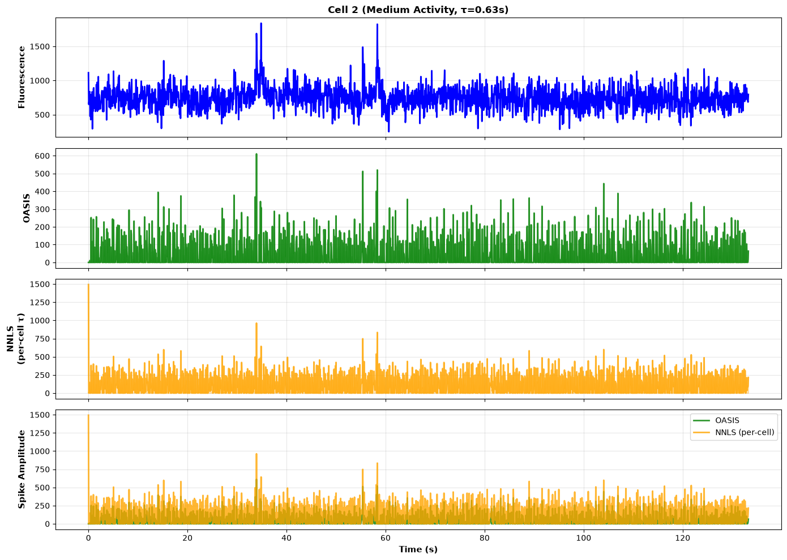
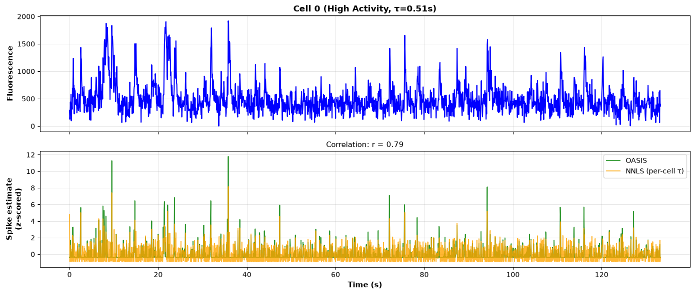

*Top: raw fluorescence. Bottom: Suite2p's OASIS output and this exercise's per-cell deconvolution, both z-scored and overlaid directly (not thresholded into discrete events — see why above). The two traces track each other closely; the correlation value shown is the actual comparison metric, consistent with the ~0.81 mean across all 30 cells.*

❗ **Commit and push your progress** before starting Exercise 3. Exercise 2 is the most involved piece of work so far, so this is a good one to commit as more than one chunk rather than everything at once. Ask Cline: "Commit my Deliverable 1 (synthetic validation) and Deliverable 2 (real data) work as two separate commits, each with its own descriptive message, then push." Two focused commits are much easier to look back on later than one commit that quietly bundles two different pieces of work together.

---

## Exercise 3: ROI Detection (Challenge)

Exercise 1 and Exercise 2 both started from cells Suite2p had *already found* — you were handed a per-cell fluorescence trace and asked to clean it up or decode it. This exercise asks the question that comes before either of those: how did Suite2p know where those 125 cells were in a 1024×1024 grid of noisy grayscale video in the first place? Finding a neuron turns out to be its own hard problem, worth an exercise of its own, and — as you'll see — the way Suite2p actually solves it looks nothing like "look at a picture and spot the round blobs."

### The Problem

Before analyzing a neuron, you must **find it** in the raw imaging data. Four things make that hard:

1. **Neurons are small** (~10–15 μm in this dataset, but pixels are ~0.4 μm)
2. **Neuropil is bright** — sometimes brighter than cell bodies
3. **Noise is everywhere** — shot noise, autofluorescence, motion artifacts
4. **Cells overlap** — dendrites cross, tissue is densely packed

### The Existing Solution, and How Your Task Differs From It

Suite2p's default detector (**Sparsery**, [docs](https://suite2p.readthedocs.io/en/latest/roidetection/)) doesn't look at a picture at all, in the sense you might expect — it decomposes the *whole movie* (thousands of frames), searching directly for sources that are spatially compact *and* temporally sparse (active in only a fraction of frames). Concretely: a real cell's pixels rise and fall together over time, in a pattern that's specific to that cell's own activity, while a bright patch of neuropil tends to be steady, diffuse, or driven by some shared, population-wide timecourse instead. Sparsery is looking for *that distinction* — a signature that only exists across time — not for "which pixels are bright."

A single averaged image necessarily throws that signature away: once you've averaged 4535 frames down to one, there's no way to recover which pixels rose and fell together and which didn't. **This is the core way your task differs from Suite2p's**: you'll be working from exactly the kind of single static image Sparsery deliberately avoids relying on, so you'll get to measure, with real numbers, how much that costs you.

**Why not just reimplement Sparsery instead of a simpler baseline?** It's an iterative matrix-decomposition algorithm — a real software engineering project on its own, well beyond what a single exercise can ask of you.

**Your task**: build the *simplest possible* baseline — threshold a single static image, then group the surviving pixels into candidate cells — and measure exactly how much performance you lose by ignoring the movie's temporal structure entirely. Seeing that gap firsthand, with real numbers, is what motivates why a more sophisticated, movie-aware method like Sparsery exists in the first place.

💬 If it's not intuitive why "the whole movie" is more informative than "a picture of the average," ask Cline for an example of two things that would look identical in a time-averaged image but obviously different if you watched them over time — that's the exact gap this exercise is measuring.

### Deliverable 1 — Detect and Match by Position

**Goal**: detect cells from the static mean image alone, match them against Suite2p's own ROIs by position, and report sensitivity (what fraction of real cells did you find?) and precision (what fraction of your detections are real?). Then look at where your false positives and false negatives cluster, and figure out why.

**Data**: Use all 125 of Suite2p's detected ROIs (`stat.npy`) as your ground truth, not just the 113 good-quality ones — the benchmark numbers below include the lower-confidence detections too. Use `ops['meanImg']` (from `ops.npy`) for the image — **not** `F.mean(axis=1)`, which gives one number per already-detected cell, not a spatial image at all.

**Scaffolding** — the concrete shape of "smooth → threshold → connected components → match":

1. Smooth the mean image lightly: `scipy.ndimage.gaussian_filter(mean_img, sigma=~0.7)`. This merges single-pixel noise specks into the shape of the blob they're part of, before you threshold.
2. Pick a threshold as a percentile of the smoothed image's pixel values (`np.percentile(smoothed, p)`), not a fixed count — raw brightness varies a lot by dataset, but "top X% of pixels" is comparable across datasets. Start high (try 95–99); the intuitive "80th percentile" choice lets in far more diffuse neuropil than you'd expect.
3. Threshold to a binary mask (`binary = smoothed > threshold`), then label connected regions: `labeled, n = scipy.ndimage.label(binary)`. Each labeled region is one candidate detection.
4. For each region, compute its pixel count and centroid. Keep only regions whose size falls in a range matching real cell sizes — this dataset's own ROIs span 31–1173 pixels, so a bare `> 10` floor keeps far too much noise and neuropil debris.
5. Match each surviving centroid to the nearest Suite2p ROI center (`stat[i]['med']`), within some distance (e.g. 30 pixels ≈ 12 μm).

⚠️ **Step 5's matching needs to be one-to-one, or your sensitivity will be silently wrong.** If you match "independently per detection" — for each detection, just grab whichever Suite2p ROI is nearest — nothing stops two different detections from both claiming the *same* real cell (common when one bright blob's threshold mask isn't quite connected, so it splits into two separate components). Every such duplicate inflates your matched count without you having actually found any additional real cell. The fix: build a list of every (detection, Suite2p ROI) pair within the distance threshold, sort by distance, and assign the closest pairs first — once a detection or a Suite2p ROI is claimed, remove it from the pool so nothing can claim it twice.

💬 If you're not sure what a "connected component" actually is, ask Cline to visualize a toy 10×10 binary grid with a couple of blobs on it, run `scipy.ndimage.label` on it, and show you the resulting labeled array — much more concrete than the general idea of "grouping touching pixels."

💬 If your sensitivity/precision look nowhere close to the numbers below (e.g. both near 0%), that's usually a sign something upstream is off — wrong image, wrong coordinate order, or a threshold that's degenerate. Describe your numbers to Cline and it can help you narrow down where.

**Results should look something like this** (this dataset, with one-to-one matching):
- With a loose 80th-percentile threshold and a bare `size > 10` filter: sensitivity **28.8%**, precision **19.5%**
- With a 99th-percentile threshold and a size filter matching real cell dimensions (20–1500 pixels): sensitivity **29.6%**, precision **39.8%**
- Tuning roughly **doubled precision** (19.5% → 39.8%) but left **sensitivity essentially flat** (28.8% → 29.6%). That asymmetry makes sense once you know why: raising the threshold only ever *removes* detections, so it can stop you mistaking neuropil for cells, but it can never rescue a real cell that was already too dim to cross the cutoff. Tuning fixes precision problems; it can't fix sensitivity problems caused by dim real cells.
- Even tuned, this remains well below Suite2p's Sparsery

**Where do the errors cluster, and why?** In this dataset there's a real, measurable answer: the field of view is not evenly lit — one half is substantially brighter than the other (ordinary 2p vignetting, not biology). A single global threshold is calibrated to the *whole* image's brightness, so false positives cluster heavily in the brighter half (ordinary background there is already bright enough to cross a cutoff meant for cell bodies), while missed cells are, on average, measurably dimmer at their center than found cells — independent of where they sit. Check this in your own data: split the image in half, compare mean brightness, and check whether your false positives/negatives split unevenly across that line.

### Deliverable 2 — Does "Matched" Mean "Same Signal"?

Position-matching only checks whether your detection's *center* landed near a Suite2p ROI's center — it says nothing about whether your detected pixels actually capture that cell's activity. A detection could sit right next to a real cell and still count as a "true positive," while actually measuring something else.

**Method**: For every matched pair from Deliverable 1, pull your detection's own raw pixel-averaged trace directly from the movie (`ops.npy`'s registered TIFF, not anything Suite2p precomputed), and correlate it against Suite2p's own `F` trace for that same cell. Then look at a few of your best- and worst-correlated matches side by side — both the image (do the two ROI outlines actually overlap?) and the traces (do they move together?).

**Results should look something like this** (this dataset, using the tuned detector and one-to-one matches from Deliverable 1):
- Across the 37 matched pairs: mean correlation **0.57**, median **0.56**, range **[0.17, 0.93]**
- 23 of 37 matches (62%) have correlation > 0.5 — genuinely capturing the same signal
- 2 of 37 matches (5%) have correlation < 0.2 — spatially "close enough" but not the same signal
- Most position-matches do hold up as real signal matches, but a meaningful minority don't — sensitivity and precision alone would never have told you that

### What Your Results Might Look Like

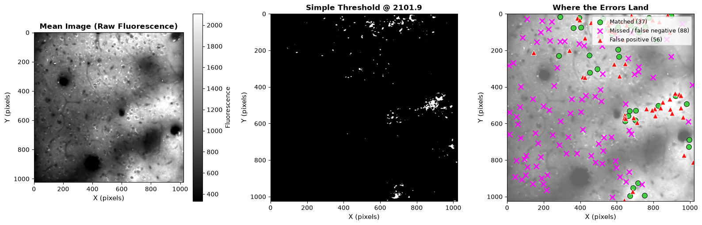

*Left: the raw mean fluorescence image. Middle: the smoothed threshold mask — notice it's not spread evenly across the image. Right: every Suite2p ROI and detection, color-coded by outcome (green = matched, magenta = missed/false negative, red = false positive) — the errors cluster visibly in the brighter half of the image, exactly matching the illumination-gradient explanation above.*

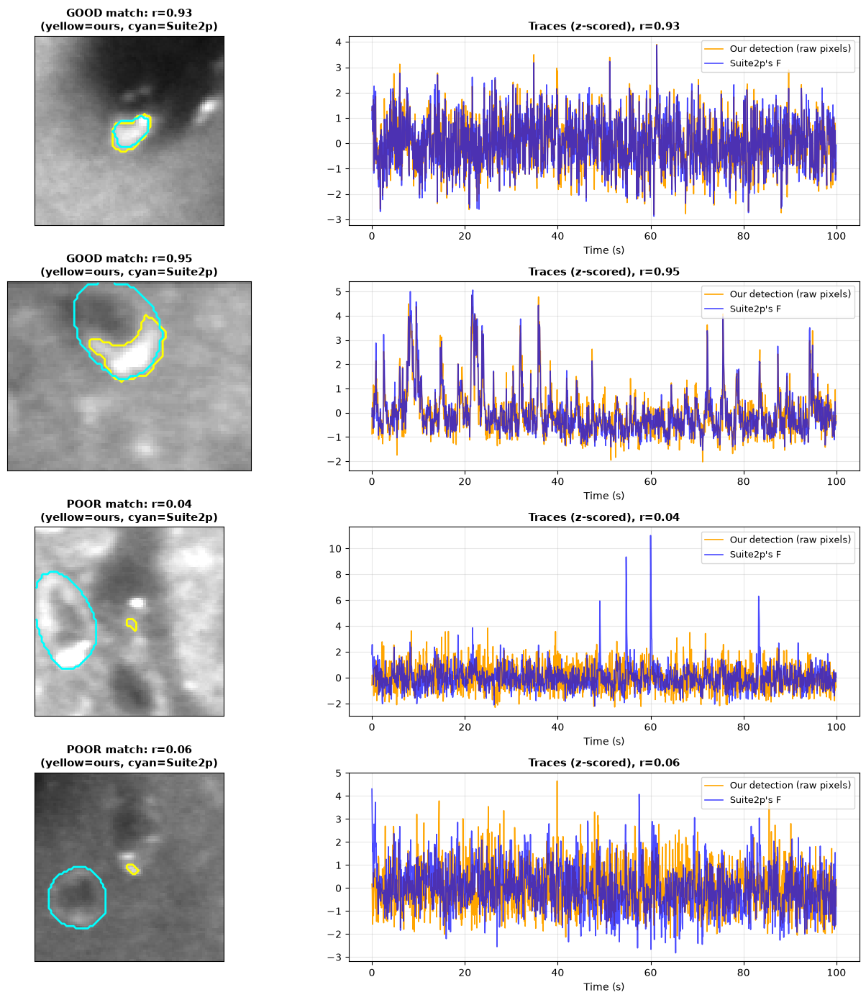

*Top two rows: "good" matches — the yellow (yours) and cyan (Suite2p) outlines visibly overlap, and the z-scored traces track each other closely. Bottom two rows: "poor" matches — same position-matching criterion counted these as correct, but the outlines are clearly different blobs and the traces don't correlate at all.*

💬 Looking at your own "poor match" examples, ask Cline to help you think through a fix — would a smaller matching-distance threshold help, or would it just trade false "matches" for missed real ones? You don't need to implement a fix; reasoning through the tradeoff out loud (with Cline pushing back) is the useful part.

### What You'll Discover

After implementing a simple detector, you'll see:
1. **You miss most real cells** — a single mean image doesn't separate cells from background nearly as cleanly as you'd hope
2. **Most of your detections are false positives** — bright neuropil regions and imaging artifacts pass the same threshold real cells do, and tuning only partly fixes this
3. **The errors aren't random — a specific, fixable cause explains a real chunk of them**: uneven illumination across the field of view means a single global threshold behaves inconsistently from one region to another
4. **But a deeper cause remains no matter how well you tune**: some real cells simply aren't much brighter than their surroundings in *any* single frame, even though they're clearly active over time — a static image cannot see activity, only brightness
5. **"Correct" isn't binary**: even among your position-matched "true positives," some have essentially no signal agreement with the cell they supposedly matched — sensitivity and precision alone hide this
6. **A metric is only as trustworthy as its matching rule**: matching each detection independently to its nearest real cell (instead of one-to-one) lets several detections double-claim the same cell, inflating sensitivity without ever finding an additional real one. This isn't specific to ROI detection — it's a general pitfall in any evaluation that matches predictions to ground truth, and it's worth checking for whenever a "matched count" feeds into a headline number
7. **Why Suite2p's default beats this**: by using the whole movie (not one static image), Suite2p can distinguish sources based on *when* they're active, not just how bright they are on average — information a single-image threshold simply doesn't have access to, no matter how it's tuned

This teaches you: **not every gap between a simple method and the real pipeline has the same cause. Some of it is a fixable weakness in your simple method (here, a global threshold's blindness to uneven illumination); the rest is a fundamental information gap (here, a static image discarding all temporal structure) that no amount of tuning on a single image can ever close. Telling those two apart — instead of lumping every shortfall into "needs a better algorithm" — is the actual skill this exercise is teaching.**

❗ **Commit and push your final progress.** Ask Cline: "Commit and push all my Exercise 3 work, then show me the full commit history for my branch so I can see everything I've done across all three exercises." A good last check before you're done — both to confirm nothing got missed, and to see your own progress laid out end to end.

---

## Looking Back: What These Three Exercises Actually Taught

**On the analysis side**, all three exercises are variations on one theme: a real measurement is a mixture of signal and something else, and getting to the signal requires an explicit, checkable model of what that "something else" is — not a bigger dataset or a fancier black box.
- **Exercise 1**: the contamination is additive and comes from a source you can measure separately (`Fneu`) — so it's removable with a simple, physically-motivated correction, and you can *prove* it worked by watching a correlation drop.
- **Exercise 2**: the "something else" is time itself — a spike's effect is smeared across many frames by calcium kinetics, so recovering spikes means solving an explicit inverse problem, not staring at the trace harder. You validated on synthetic data with a known answer *before* trusting the method on anything real — arguably the single most important habit in the whole exercise.
- **Exercise 3**: the "something else" is a missing dimension entirely — a static image discards the temporal information a real cell's activity is actually defined by, and no amount of threshold-tuning on that image can put it back. That's a fundamentally different kind of limitation than a parameter you can tune, and telling the two apart was the actual point.

Across all three, the same discipline shows up: build the simplest model that could plausibly work, measure exactly how well it does against a real reference (Suite2p, or ground truth you generated yourself), and use the *size and shape* of the gap to explain *why* — not just to note that a gap exists.

**On the AI-agent side**, you used Cline for the entire spectrum of this work, from setting up a virtual environment to debugging a matching bug buried in Exercise 3's evaluation metric. A few habits mattered more than others:
- **Plan before you act.** Getting Cline to lay out its approach before writing any code catches a misunderstood requirement while it's still one sentence, not a multi-file mess to untangle afterward.
- **Ask "why," not just "how."** Understanding what a Toeplitz matrix is, or why exponential decay follows from calcium clearance kinetics, is what let you judge whether Cline's code was solving the right problem — not just whether it ran without error.
- **Never trust a result you haven't checked.** Every real number in this README exists because it was validated against something independent — synthetic ground truth, Suite2p's own output, or the dataset's own saved settings. That habit was deliberate throughout: a number is not credible just because code produced it.
- **Not knowing the syntax was never the blocker.** If you came in without strong Python skills, that was fine by design — the actual skill these exercises built is knowing what to ask for, how to tell whether the answer is right, and when to push back and ask again. That skill transfers to any future project with an AI coding assistant, not just this dataset.

That combination — a real, falsifiable model of your data, and a disciplined way of working with an agent that can write code faster than you can read it — is the actual takeaway here, more than any single number in this README.
