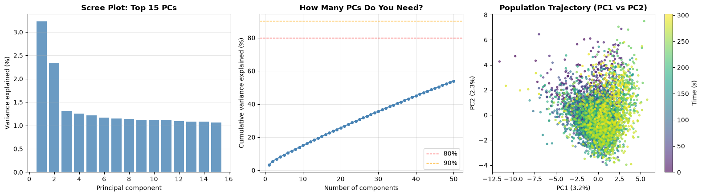
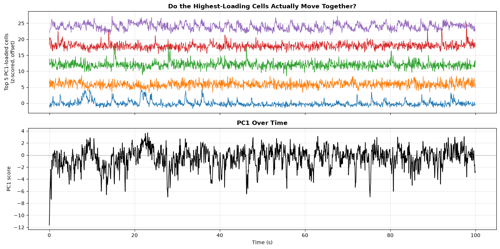
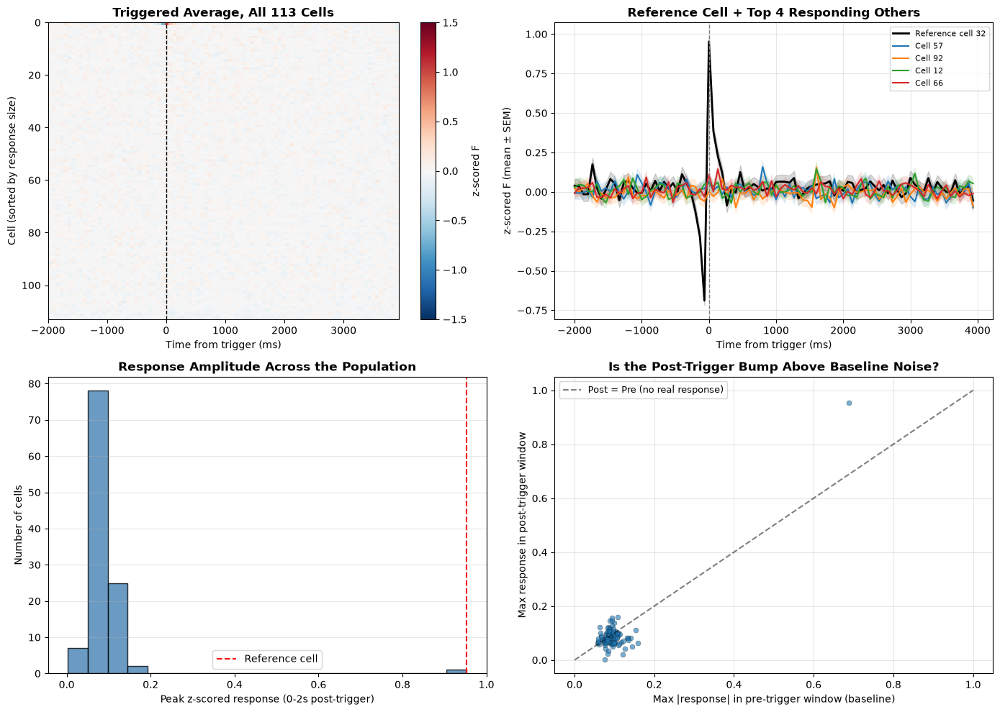
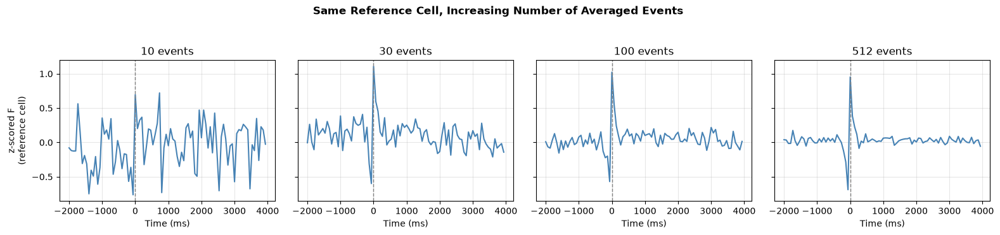

# Saturday Exercises: Population Analysis with Agentic AI

## From Single Cells to the Population

**Roadmap**: This document assumes you've already been through the [main Friday exercises](README.md) — same dataset, same setup, same Claude Code workflow, same emoji conventions (see the glossary below). If you haven't done Step 0 and Exercise 1 yet, do those first: everything here starts from the corrected fluorescence they produce.

**Emoji glossary** (same as the main README):

| Marker | Meaning |
|---|---|
| ❗ | Really important — don't skip this. |
| ⚠️ | A silent pitfall — something that will quietly produce wrong results if you get it wrong. |
| ✅ | Verified, not assumed — checked against this dataset's actual saved settings or output. |
| 💬 | A Claude Code tip — optional, not required to complete the exercise. |

### What This Is About

Every exercise in the main README treated cells **one at a time**: clean one cell's trace, deconvolve one cell's spikes, find one cell's location. This document asks a different kind of question — looking at the *whole population* of good cells together, at every timepoint, is there structure? Do groups of neurons rise and fall together, or does each cell do its own independent thing? And when one neuron fires, do others respond?

Two techniques, two different ways of asking that:

1. **PCA (Exercise 4)** — does the *whole recording's* population activity live in a low-dimensional subspace, or does it genuinely need most of its dimensions?
2. **Spike-triggered averaging (Exercise 5)** — locked to *one specific cell's* spike times, does any other cell show a systematic, repeatable response?

❗ **Use the same dataset as the main exercises.** `TSeries-03042024-run02-054`, corrected fluorescence (`F - 0.7*Fneu`), the 113 good-quality cells (`iscell[:,0]==1`). Every number below was generated from exactly this data, with this correction, with this cell filter — a different choice anywhere in that chain will change your numbers.

---

## Exercise 4: Population Structure via PCA

### The Problem

You have 113 good cells and 4535 frames — in other words, 4535 points in a 113-dimensional space (one dimension per cell). That's too many dimensions to look at directly. PCA finds the directions in that 113-dimensional space along which those 4535 points vary the most — the patterns of co-activity that repeat most often across the recording.

**The math**: stack the z-scored fluorescence into a data matrix $X$ of shape (4535 frames × 113 cells) — the orientation from the pitfall below. PCA finds $X$'s principal directions via its singular value decomposition, $X = U\Sigma V^T$: the columns of $V$ (`pca.components_`, one per component) are the loading vectors in cell-space, the diagonal of $\Sigma$ says how much variance each direction captures, and $U\Sigma$ (`pca_scores` in the code) is the population's trajectory projected onto those directions — one score per frame, per component. `explained_variance_ratio_` is each squared singular value divided by the sum of all of them: what fraction of the population's total frame-to-frame variance that one direction accounts for.

Equivalently — and this is the sense in which PCA is a genuine measure of population coordination, not just a dimensionality-reduction trick — this is exact eigen-decomposition of the 113×113 cell-by-cell covariance matrix $C = \frac{1}{n-1}X^TX$. Entry $(i,j)$ of $C$ is literally "how much does cell $i$'s activity co-vary with cell $j$'s, across the whole recording." PCA's components are this matrix's eigenvectors, ranked by eigenvalue — the directions in which that co-variation structure is strongest.

**Why do this on this specific dataset**: this is a spontaneous-activity recording of many simultaneously-imaged neurons in the same small patch of cortex — exactly the setting where PCA is informative, and exactly the setting where it isn't guaranteed to find anything. If these cells share common input (shared thalamic drive, a population-wide state like arousal or locomotion, dense local recurrent connectivity), that shared input should make many cells' activity rise and fall together — a mode of variation PCA is built to detect without you ever having to pre-specify which cells belong together. But nothing about two-photon calcium imaging *guarantees* that structure exists: if these cells really do fire off largely independent, unshared local inputs, PCA should — and, as you'll see, largely does — turn up something closer to flat, undifferentiated variance spread across most components. Running PCA on *this* recording is how you find out which of those two pictures is actually closer to true here, instead of assuming one from a general intuition about "neural populations."

**Why z-score first**: cells differ hugely in absolute brightness — a bright ROI with strong indicator expression can have raw fluorescence values 10× another cell's. If you ran PCA on raw values, the brightest cells would dominate every component just because their numbers are larger, regardless of whether they're the most *interesting* ones. Z-scoring (mean 0, std 1 per cell) puts every cell on equal footing, so PCA finds genuine co-variation, not "which cells happen to be bright."

⚠️ **PCA needs to be fit on (frames × cells), not (cells × frames).** Your data is naturally stored as 113 cells × 4535 frames — each row is one cell's whole trace. But PCA's job is to find directions in *cell-space*, which means each **frame** needs to be one data point and each **cell** needs to be one feature — the transpose of how the data is stored. Fit on `F_norm.T` (shape 4535 × 113), not `F_norm` directly, or you'll get 4535 components describing frame-space instead of 113 components describing cell-space.

💬 If "fit PCA on the transpose" doesn't click immediately, ask Claude Code to walk through what `pca.fit_transform()` actually expects as input shape, and why swapping rows/columns here changes what a "component" even means.

### Deliverable

Z-score each good cell's corrected fluorescence, fit PCA with enough components to see the full curve (e.g. 50), and report: how much variance does PC1 alone explain? How many components does it take to reach 80%/90% cumulative variance? Then look at which cells drive PC1 most strongly, and check directly (by plotting their raw traces) whether those cells actually move together the way the loading implies.

**Results should look something like this** (this dataset):
- **PC1 alone explains only 3.2%** of total variance. PC1+PC2+PC3 together: 6.9%. The top 10 PCs combined: 15.0%.
- **It takes 51 of the 113 possible components to reach 80–90% cumulative variance.**
- ✅ These numbers were cross-checked against an earlier, independent run of the same analysis on a near-identical version of this dataset (111 cells instead of 113, from a slightly different quality-filter convention) — that run gave PC1=3.3%, PC1+PC2+PC3=7.0%, top 10=15.3%, essentially identical to the numbers above. The result is stable, not a fluke of one particular run.

**This is a real, somewhat non-textbook finding, not a disappointing result to explain away.** A common intuition (sometimes over-generalized from stimulus-driven or motor-cortex recordings) is "neural populations live in a low-dimensional subspace — a handful of PCs should explain most of the variance." *On this dataset* — spontaneous activity, 113 cells, 5 minutes, z-scored per cell — that's not what happens: the cumulative-variance curve rises almost linearly (see the figure below), which is closer to what you'd expect if most of each cell's variance were its own largely-independent fluctuation, with only a modest shared component riding on top. That doesn't mean PCA "failed" — it means this particular population, analyzed this way, is measurably closer to high-dimensional than low-dimensional, and that's a legitimate, informative answer to the question the exercise asked.

💬 Worth asking Claude Code directly: would a different preprocessing choice (e.g. smoothing before z-scoring, or using deconvolved spikes instead of raw fluorescence) be likely to change this conclusion, or is a near-linear cumulative-variance curve robust to those choices? Reasoning through *why* is more valuable than just trying it.

### What Your Results Might Look Like

*Left: scree plot — PC1 barely edges out PC2 (3.2% vs 2.3%), no single dominant mode. Middle: cumulative variance rises almost linearly with the number of components, nowhere near the 80%/90% reference lines even at 50 components — the signature of variance spread broadly across many dimensions, not concentrated in a few. Right: the PC1-vs-PC2 population trajectory over time — a diffuse blob with no obvious cyclic or looping structure.*

*Top: the five cells with the largest |loading| on PC1, z-scored and offset. Bottom: PC1's own score over time. Despite PC1 explaining only 3.2% of total variance, several visible, simultaneous bumps in the top-loaded cells' raw traces (e.g. around 13s, 22s, 28s, 46s) line up with real excursions in PC1 below — a small share of *total* variance can still correspond to a real, visible, shared event, because most of the total variance is each cell's own largely-independent fluctuation.*

💬 Ask Claude Code to help you pick a different handful of cells — say, ones with near-zero PC1 loading — and overlay *those* instead. Seeing that the low-loading cells' bumps do *not* line up with PC1 the way the high-loading cells' do is a good concrete check that the loadings are actually meaningful, not just noise.

---

## Exercise 5: Spike-Triggered Average

### The Problem

Pick one cell as a "reference." Every time it (allegedly) spikes, cut out a window of *every* cell's fluorescence around that moment, then average across all those windows. If some other cell is functionally coupled to the reference — driven by shared input, or synaptically connected to it — its average trace should show a systematic bump (or dip) right around the trigger. If it's unrelated, averaging over many trigger times should wash any one-off coincidence out to flat noise.

This works on a purely spontaneous recording — no experimenter-delivered stimulus needed — because the "trigger" here is a spike time from a cell *in* the recording, not an external event.

**The math**: for reference-cell trigger times $t_1, \ldots, t_N$ and any cell's z-scored trace $x(t)$, the spike-triggered average at lag $\tau$ is

$$\text{STA}(\tau) = \frac{1}{N}\sum_{i=1}^{N} x(t_i + \tau)$$

This is a direct estimator of $E[x(t+\tau) \mid \text{trigger at } t]$ — the expected value of that cell's activity at lag $\tau$ from a trigger, averaged over every trigger you have. Write $x(t) = s(\tau) + \epsilon(t)$, where $s(\tau)$ is some fixed, trigger-locked response shape and $\epsilon(t)$ is zero-mean noise uncorrelated with the trigger times. Then $\text{STA}(\tau) \to s(\tau)$ as $N \to \infty$ by the law of large numbers, and the estimate's own standard error at each lag shrinks like $1/\sqrt{N}$ — exactly the SEM you compute in Step 2, and exactly why the convergence plot in Step 4 stabilizes as $N$ grows rather than converging instantly or never.

**The bigger idea this is one example of**: nothing about that formula actually cares what $t_1, \ldots, t_N$ *are* — they just need to be repeated, timestamped moments you can align to. Here they happen to be another cell's spikes, but they could just as easily be a stimulus turning on, a lever press, the start of a running bout, or a whisker touch. Swap in a behavioral event for the trigger and you're asking the exact same question — "does this cell's activity reliably change around this moment?" — with the same trick making it work: average enough repeats, and only the part that's actually locked to the event survives, while everything else averages toward flat. This general move (align to a repeated event, then average) is usually called an **event-triggered average**, and spike-triggered averaging is simply the special case where the event is another neuron's own spike rather than something in the world.

This is also, at heart, the same idea behind the **PSTH (peri-stimulus/peri-event time histogram)** — one of the most common plots in systems neuroscience. A PSTH counts a neuron's spikes in short time bins around each trial's event (a stimulus onset, say), then averages those counts across trials to show how firing rate rises and falls around that moment. It's built from the same two steps you're using here — align, then average — just applied to spike counts across repeated experimental trials instead of a continuous fluorescence trace across one spontaneous recording.

**Why do this on this specific dataset**: this recording has no experimenter-delivered stimulus to trigger on — it's spontaneous activity, start to finish. That's exactly the situation spike-triggered averaging exists to work around: instead of an external event, you use one neuron's own inferred spike times as the trigger, which turns a purely spontaneous recording into something you can still probe for pairwise structure. If two cells are functionally coupled — common input, or a direct or indirect connection — the coupled cell's fluorescence should be predictably elevated (or suppressed) right around the reference cell's spike times, on average, across many such events. Whether that's actually true here isn't assumed going in; Exercise 5 is exactly the test of it for this population — and, as you'll see, the honest answer for this specific recording is a fairly clean no, beyond the reference cell's own trivial response to itself.

**Why averaging is the whole point**: any single trial is dominated by noise unrelated to the trigger. Averaging is what separates a repeatable, trigger-locked response from that noise — noise that isn't systematically tied to the trigger time cancels out as you combine more trials, while a genuine coupled response (which *is* tied to the trigger) survives the average and grows clearer.

⚠️ **Suite2p's `spks.npy` is continuous, not a 0/1 spike train** (same fact Exercise 2 relies on) — you need `scipy.signal.find_peaks` with a height relative to that cell's own max, exactly as in Exercise 2, to get discrete trigger *times* out of it.

### Deliverable

Pick a reference cell (any good cell with a reasonable number of spikes works — the most active one is a fine default), get its trigger times, align every good cell's z-scored trace to those times, and average. Track the standard error per cell per timepoint too — that's what tells you whether a bump in the average is distinguishable from noise, or just leftover wiggle from too few events. Then ask directly: does the reference cell's own average look like a sensible self-response (a sanity check), and does *any other* cell's average clearly exceed its own pre-trigger baseline noise (the actual coupling question)?

**Results should look something like this** (this dataset, reference = the most active good cell, 512 valid trigger events):
- **The reference cell's own triggered average is large and clean**: peak z-scored response ≈ **0.95**, visibly separated from its own pre-trigger baseline.
- **Every other cell's peak response is far smaller**: the best three *other* cells top out around 0.14–0.16 — roughly **6× smaller** than the reference cell's own response to itself.
- 47 of 112 other cells technically have a post-trigger peak larger than their own pre-trigger peak, but by a trivial margin (e.g. 0.09 vs. 0.08) — not a meaningfully distinguishable response, just noise variation. Only the reference cell's own response is unambiguous.
- ✅ This isn't a quirk of which cell got picked as reference: repeating this with 14 other candidate reference cells gave the same qualitative pattern every time — the reference cell's own response was always 5–10× the size of the best "other" cell's response.

**This is a real, informative null result, not a failed analysis.** The technique demonstrably works — the reference cell responding to its own spike times, right on schedule, is exactly the positive control you'd want to see, and confirms the alignment and thresholding logic is correct. What it *doesn't* find, on this recording, with this method, is strong evidence that other cells are tightly, repeatably coupled to the reference cell's spike times. That's a legitimate answer: not every real neural population shows dramatic pairwise spike-triggered coupling, and a clean null result (backed by a working positive control) is more trustworthy than a forced, marginal "finding" squeezed out of noise.

This connects back to the PCA result above: both analyses, independently, point the same direction for this dataset — real structure exists (PC1's loaded cells did show visible synchronized bumps; a handful of cells here do sit slightly above their own noise floor), but it's modest and distributed, not a dramatic, dominant, easy-to-find signal. Two different techniques agreeing on "the coordination here is real but weak" is more convincing than either one alone.

💬 Ask Claude Code: given that 47/112 cells nominally "exceed" their own baseline, how would you decide whether that's more than chance would produce? (Hint: what would you expect if you shuffled the trigger times randomly and re-ran the same analysis?) You don't need to implement the shuffle test — reasoning through why a nominal count without a chance comparison can be misleading is the useful part.

### What Your Results Might Look Like

*Top left: every good cell's triggered average, sorted by response size — a thin bright line at the very top (the reference cell) against an otherwise flat field. Top right: the reference cell (black) shows a clear dip-then-spike right at the trigger; the four best "other" cells (colored) are indistinguishable from flat noise at the same scale. Bottom left: the distribution of peak response across the whole population — 112 cells clustered near zero, one clear outlier (the reference cell itself). Bottom right: post-trigger peak vs. pre-trigger peak for every cell — only the reference cell sits meaningfully above the "no real response" diagonal.*

*The same reference cell's own triggered average, built from an increasing number of events (10 → 30 → 100 → 512). At 10 events the shape is still noisy and unstable; by ~100 it's already close to its final shape. This is the concrete answer to "how many trials do I need" — check where your own curve stops changing shape as you add more events, rather than assuming a fixed number is always enough.*

---

## Looking Back: What These Two Analyses Actually Taught

**On the analysis side**: both exercises asked the same underlying question from two different angles — "is there real structure that connects multiple cells, or is each cell basically on its own?" — and both got the same honest answer for this dataset: **some structure exists, but it's modest, not dominant.** PCA needed most of its dimensions to explain most of the variance; the triggered average found a working, validated method that turned up no strong evidence of pairwise coupling beyond the reference cell's trivial self-response. Neither of those is a disappointing result. A method that can honestly report "the effect here is small" — backed by a working positive control (PCA's visible PC1-loaded bumps; the triggered average's clean self-response) — is more trustworthy than a method that's forced to find something dramatic in every dataset it's pointed at. Knowing how to tell a real, modest effect apart from an artifact or a forced conclusion is the actual skill here, not any specific percentage or plot shape.

**On the AI-agent side**: the same habits from the main exercises apply directly here — verify a claim before trusting it (the PCA numbers were cross-checked against an independent run before being reported; the triggered-average null result was checked against 14 other reference cells before being written up as general rather than a fluke), ask "why," not just "how" (understanding *why* PCA needs frames-as-rows, not just being told to transpose, is what lets you catch it if you get the orientation backwards), and don't take a single number at face value (47/112 "responding" cells sounds like a real effect until you check the actual magnitude and realize it's noise-level).

❗ **Commit and push your progress.** Ask Claude Code: "Commit and push my Exercise 4 and Exercise 5 work, with a descriptive message for each." Same habit as the main exercises — don't let a session's work sit uncommitted.
